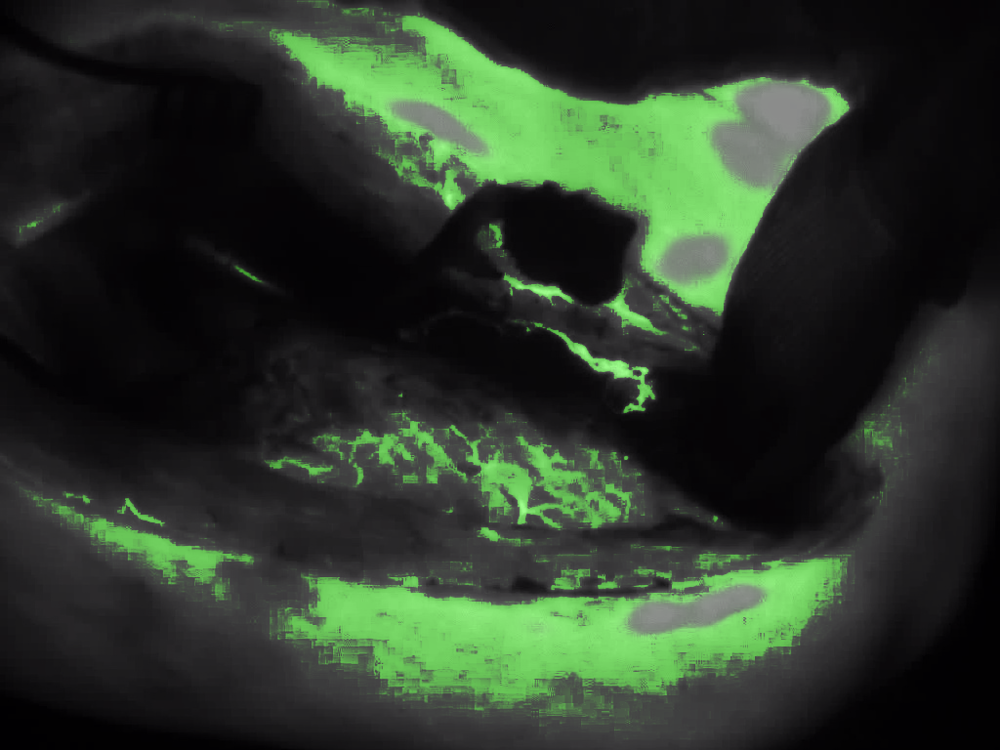
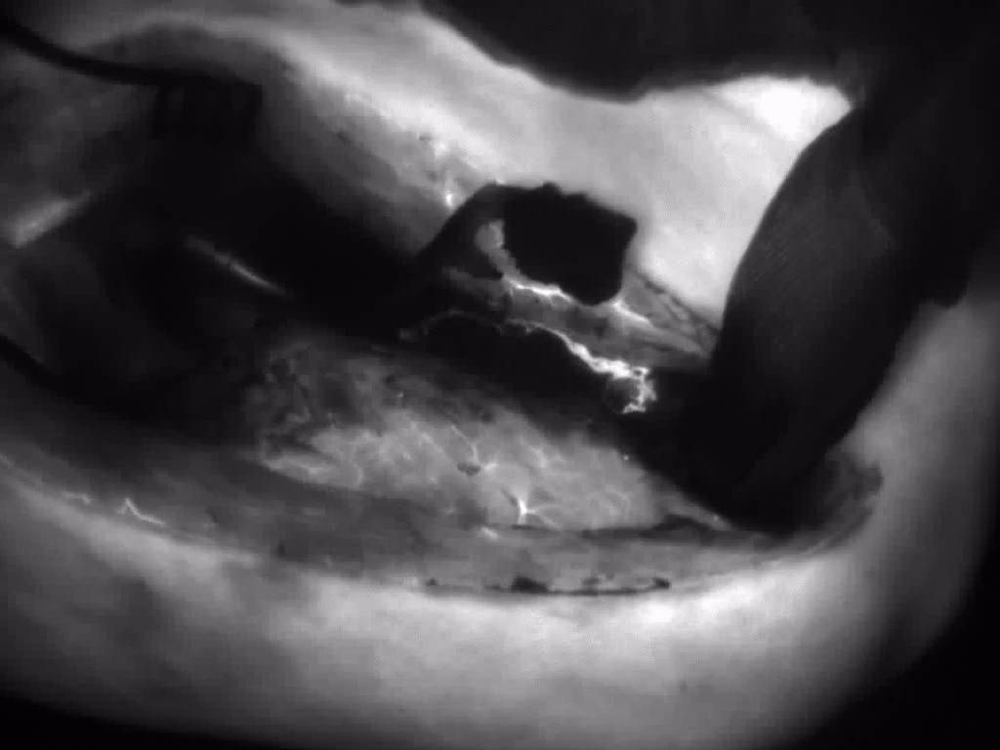
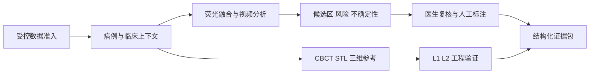

<p align="center">
  
</p>

<h1 align="center">OSTEO VISION</h1>

<p align="center">
  面向颌骨骨髓炎术中辅助决策的荧光 - 三维证据闭环平台
</p>

<p align="center">
  <a href="#快速开始">快速开始</a> ·
  <a href="#平台能力">平台能力</a> ·
  <a href="#工程闭环">工程闭环</a> ·
  <a href="#文档导航">文档导航</a>
</p>

<p align="center">
  
  
  
  
  
</p>

> [!IMPORTANT]
> 平台输出服务于工程验证和医生复核。输出不构成临床诊断、切除范围结论或真实术中导航结论。ICG 信号用于反映灌注、血管通透性和组织活性差异，颌骨骨髓炎目标域性能与真实设备精度仍需独立验证。

## 平台概览

`osteo-vision` 以赛题确认的 JPEG、MP4 文件输入为主路径，形成术前数字化规划、术中多模态判读、术后证据回顾的完整平台软件闭环。设备驱动、厂商私有 SDK 和采集侧适配由设备方负责；平台支持标准化文件和离线 manifest 接入。

| 输入与准入 | 融合与辅助判读 | 证据与空间参考 |
|---|---|---|
| JPEG、MP4、医院 AVI 受控转码、脱敏与 SHA256 批次准入 | 白光/ICG 配准、伪彩、融合、ROI 定量、候选区、风险与不确定性 | 医生复核、人工标注、结构化导出、CBCT/STL、L1/L2 工程验证 |

## 工程预览

<table>
  <tr>
    <td width="50%"></td>
    <td width="50%"></td>
  </tr>
  <tr>
    <td align="center"><sub>公开人体 ICG 工程代理关键帧</sub></td>
    <td align="center"><sub>严格主线的荧光信号候选叠加结果</sub></td>
  </tr>
</table>

素材来自公开人体 ICG 视频工程代理，许可为 CC BY 4.0；来源、SHA256 与用途边界见 [展示静态资产说明](frontend/public/showcase/README.md)。该预览不包含颌骨骨髓炎目标域标签、病理映射或医生复核骨面真值。

## 平台能力

| 工作区 | 已实现能力 | 当前边界 |
|---|---|---|
| 数据准入 | 机构授权、脱敏确认、文件签名、SHA256、重复项、可解码性和隔离原因码 | 仅 `admitted` 文件写入病例输入 |
| 病例工作台 | JPEG 双通道融合；单路、独立双路与 OFDVDnet 合成三视图 MP4；浏览器视频流连续帧串行推理 | 双路 MP4 使用白光主时钟、毫秒偏移和同步关键帧配准；摄像头保持单路扩展输入 |
| AI 辅助判读 | `fluorescence_signal_mask`、`risk_mask`、`uncertain_mask`、候选区与性能元数据 | 当前主线指标属于公开异域或伪标注代理工程证据 |
| 医生复核 | 像素级标注、版本历史、独立复核、训练准入状态和可信身份边界 | 医生复核完成前保持受控训练权重 |
| 三维导航 | CBCT/STL、对象树、表面建模检查、L1 静态配准、L2 离线位姿回放 | 缺少坐标、误差、同步或复核证据时固定为 L0 未配准参考 |
| 结果导出 | JSON、Markdown、CSV、DICOM Secondary Capture 和 ZIP 病例证据包 | 所有导出保留医生复核与非诊断边界 |

## 工程闭环



### 三项持续目标

| 目标 | 当前软件闭环 | 运行安全状态 |
|---|---|---|
| 患者条件分割 | 临床变量契约、持久化、界面、代理训练与差异证据已接入 | 当前严格运行保留影像基础结果 |
| 骨活性分层 | 骨面内低活性、过渡区、高活性、无法判断区与连续评分复核链路已接入 | 空间候选保持受控，等待目标域验证 |
| 三维配准与离线 AR | 倍率、工作距离、标定、变换、L1 与 L2 证据链可记录和回放 | 当前显示为未配准三维参考，等待物理精度验证 |

## 快速开始

### 环境要求

- Windows 10/11
- Conda 与 Python 3.11
- Node.js 与 npm
- FFmpeg / ffprobe

### 一键启动

```powershell
# 首次安装
conda env create -f environment.yml
conda activate osteo-vision
npm --prefix frontend install

# 启动完整平台软件
.\start_platform.cmd
```

默认服务地址：

| 服务 | 地址 |
|---|---|
| 后端 API | `http://127.0.0.1:8001` |
| 前端工作站 | `http://127.0.0.1:5174/` |
| 独立三维渲染运行时 | `http://127.0.0.1:5175/` |

根目录启动入口会执行严格运行预检、checkpoint sidecar 检查、FFmpeg/ffprobe 检查、后端就绪校验、路由检查、模型预热并启动独立三维运行时。启动时会创建并默认载入 `OFDVDNET_001` 标准示例病例，预热白光、荧光和设备叠加三路拆分缓存，并关联 D024 公开下颌表面参考；资源或 FFmpeg 缺失时保留原始 MP4 播放、明确的单路降级状态与 L0 三维参考。需要仅启动二维平台时可追加 `-SkipThreeDRuntime`。独立三维运行时也可单独构建、测试和部署，具体步骤见 [三维运行时说明](docs/three_d_renderer_runtime.md)。

## 当前工程基线

| 项目 | 当前值 |
|---|---|
| 工程版本 | `0.3.0-rc.2` |
| 主线模型 | `keyframe_residual_attention_unet_s20260715_20260715` |
| 4K 推理 | `512 px` tile，`64 px` overlap |
| 公开/代理数据清单 | 15 份 manifest，47 条记录，138 个本地文件，约 5.51 GB |
| 目标域训练准入记录 | 0 |

主线模型的代理 Dice `0.9177`、IoU `0.8483` 只用于非目标域工程比较。真实颌骨骨髓炎白光/ICG 联合病例、可信医生像素级金标准、全倍率设备标定和下颌仿体物理精度属于外部验证事项。

最新任务2内部工程门使用 3840×2160 确定性形变、遮挡和光学上下文切换序列：自适应多尺度配准升级为 `adaptive_multiscale_registration_v2`，增加有界二次局部残差场和时序平滑；120帧连续门中局部形变补偿覆盖率 `100%`，局部残差 P95 由 `5.187 px` 降至 `1.361 px`，零拷贝 CUDA 交接帧 `120/120`，配准与融合计算 P50/P95 为 `71.464/82.026 ms`，满足项目采用的 `<100 ms` 计算线。该序列的 JPEG 预览就绪 P95 为 `102.219 ms`，单次孤立计算尖峰仍单独记录，连续超限次数为 `0`，计算超限率为 `0.833%`；完整证据位于 `artifacts/platform_smoke/task2_nonrigid_registration_120f_zero_copy_20260725/`。任务3继续使用版本化“任务2融合图进入AI”契约，输出 mask、概率图、风险图、不确定性图、边界类型与复核置信度；边界候选新增低活性、过渡、高活性和待骨面复核状态字段，并把候选保留与活动证据写入报告和 CSV。文件 I/O、网络传输和任务3 AI 推理分阶段另行报告，真实设备同步、传输、组织形变精度和目标域骨活性性能仍需独立验证。

## 质量门

<details>
<summary>展开查看常用质量检查命令</summary>

```powershell
conda run -n osteo-vision python -m ruff check osteo_vision_core backend tests scripts tools
conda run -n osteo-vision python -m mypy osteo_vision_core backend --hide-error-context --no-error-summary
conda run -n osteo-vision python -m pytest tests/unit tests/smoke
conda run -n osteo-vision python -m pytest backend/tests
npm --prefix frontend run typecheck
npm --prefix frontend test -- --run
npm --prefix frontend run build
npm --prefix frontend/three-d-runtime run typecheck
npm --prefix frontend/three-d-runtime run test
npm --prefix frontend/three-d-runtime run build
conda run -n osteo-vision python tools/check_runtime_readiness.py --config configs/inference/osteo_vision_competition_strict.yml --require-strict
conda run -n osteo-vision python tools/check_project_readiness.py
```

</details>

## 仓库结构

```text
osteo-vision/
├── backend/                 FastAPI API、病例、复核、导出和三维服务
├── frontend/                Vue 3 + TypeScript 桌面工作站
├── frontend/three-d-runtime/ 独立三维渲染运行时
├── osteo_vision_core/       推理、模型、数据、指标和导航核心库
├── configs/                 受控任务、运行和安全配置
├── scripts/                 训练、评估和启动脚本
├── tools/                   准入、核验、性能与证据工具
├── tests/                   核心 unit、smoke 与 integration 测试
├── docs/                    当前工程文档
├── research/                文献、来源清单、建模证据和提交材料
└── start_platform.cmd       Windows 一键启动入口
```

目录职责和归档规则见 [项目结构](docs/project_structure.md)。

## 文档导航

| 主题 | 入口 |
|---|---|
| 快速启动与身份配置 | [docs/quickstart.md](docs/quickstart.md) |
| 当前项目状态 | [docs/project_summary.md](docs/project_summary.md) |
| 开发与系统架构 | [docs/development_framework.md](docs/development_framework.md) |
| 导出契约 | [docs/export_schema_v1.md](docs/export_schema_v1.md) |
| 模型晋级离线签名 | [docs/promotion_approval_offline.md](docs/promotion_approval_offline.md) |
| 研究资料索引 | [research/README.md](research/README.md) |
| 当前提交材料 | [research/reports/submission/](research/reports/submission/) |
| 版本记录 | [CHANGELOG.md](CHANGELOG.md) |

## 数据治理

- 真实患者资料采用脱敏与最小保留原则。
- 原始影像、视频、权重、数据库、密钥、三维模型和大体积派生数据保持在仓库外或 Git 忽略路径。
- 公开、代理和伪标注数据均保留来源、许可、SHA256 与用途边界。
- 可信医生独立复核完成的标注才能进入高权重训练准入评估。

---

<p align="center">
  <sub>OSTEO VISION · 颌骨骨髓炎智能化荧光诊疗平台软件</sub>
</p>
