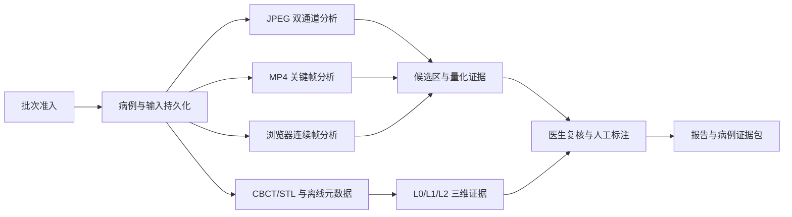

# 平台系统架构

适用版本：`0.3.0-rc.2`。本文件描述当前可运行平台的组件、数据流、持久化边界和安全降级。工程约束见 [development_framework.md](development_framework.md)，目录所有权见 [project_structure.md](project_structure.md)。

## 1. 架构目标

- 保持官方 JPEG/MP4 文件输入、荧光处理、AI 候选区、医生复核和证据导出闭环。
- 将设备驱动、厂商 SDK 和私有采集接口隔离在平台软件边界之外。
- 对目标域数据、模型晋级、患者条件、骨活性和三维配准执行失败闭合。
- 对病例、输入、模型、参数、复核、标注和导出保留可追溯证据。
- 对 4K 图像、视频关键帧和连续帧提供有界内存、串行背压和可核验耗时。

## 2. 总体数据流



官方设备技术资料确认 `3840x2160`、USB3.0 文件存储、JPEG 图片和 MP4 视频。浏览器摄像头、连续帧接口和标准化元数据属于平台软件扩展。倍率、工作距离、三路图像、标定和位姿可通过人工录入或离线 manifest 进入软件。

## 3. 组件分层

### 3.1 Vue 桌面工作站

`frontend/` 使用 Vue 3、TypeScript、Pinia 和 Vue Router。主导航按数据准入、病例档案、病例工作台、三维导航、医生复核、报告导出和研发支持排列。`frontend/three-d-runtime/` 使用独立 Vue/Vite/Three.js 运行时提供 WebGL 场景。

病例工作台集中承载视频流输入、融合图、热图、归一化/分割结果和高频控制。三维导航使用独立路由，主平台承载 CBCT/STL 导入、建模、对象树、L1/L2 和医生复核；iframe 仅嵌入版本化场景渲染。渲染运行时释放 WebGL geometry、material、texture、事件监听器和动画帧，主平台保留二维证据与安全状态。

### 3.2 FastAPI 接口层

`backend/osteo_vision_api/api/` 负责 HTTP 契约、输入验证、身份上下文、状态码、文件流和服务编排。接口层将医学处理交给应用服务，并通过 `/health`、`/ready` 和 OpenAPI 暴露运行状态。

主要接口族覆盖：

- 病例、临床上下文和输入登记。
- 原始文件上传、关键帧任务和连续帧分析。
- 医生复核、人工标注、训练准入和晋级审批。
- 报告、结构化文件和证据包导出。
- CBCT 建模、L1 静态配准和 L2 离线位姿回放。

### 3.3 应用服务层

`backend/osteo_vision_api/services/` 负责病例工作流与证据落盘。分析服务复用 `osteo_vision_core/` 的模型 adapter 和预处理能力；任务服务控制同病例并发，连续帧由前端等待上一请求完成后继续，避免无界请求积压。

病例与标注使用 SQLite repository。任务状态和证据文件写入 `artifacts/`。路径、哈希、schema version、模型 ID、阈值、回退原因和医生复核状态随结果保存。

### 3.4 核心算法层

`osteo_vision_core/` 提供可独立测试的核心能力：

| 模块 | 职责 |
|---|---|
| `osteo_vision_core/io/` | JPEG、MP4、DICOM、NIfTI、流输入和官方格式质控 |
| `osteo_vision_core/preprocess/` | 配准、荧光处理、视频抽帧、质量评估、ROI 和 mask 后处理 |
| `osteo_vision_core/models/` | adapter、关键帧分割、患者条件、骨活性和模型晋级 |
| `osteo_vision_core/datasets/` | 来源清单、患者级切分、训练准入和泄漏检查 |
| `osteo_vision_core/metrics/` | 分割、校准、亚组、安全和性能指标 |
| `osteo_vision_core/navigation/` | 坐标契约、刚体配准、相机投影和离线位姿回放 |
| `osteo_vision_core/engine/` | 通用推理、实验和 benchmark 编排 |

## 4. 三条影像分析路径

### JPEG 双通道

白光与原始荧光图进入配准、背景扣除、归一化、伪彩、融合、ROI 定量和质量检查。设备叠加图仅用于显示、质控和证据核对。通道尺寸不一致时记录重采样警告，医生仍需复核几何对齐。

### MP4 关键帧

上传服务核验文件签名、容器、解码、分辨率、帧率和时长。关键帧分析生成 mask、probability map、伪彩、叠加图、候选区、帧明细、时间稳定性和 video segmentation manifest。4K 输入使用可配置 tiling。

### 连续帧

浏览器按最长边 960 生成 JPEG 帧并串行调用 live-frame API。后端复用已加载主线模型，返回唯一证据路径、处理分辨率和端到端耗时。实时路径关闭 TTA 并保留风险图、不确定性、模型身份和安全声明。

## 5. 模型与晋级

比赛严格配置为 `configs/inference/osteo_vision_competition_strict.yml`，当前主线为 `keyframe_residual_attention_unet_s20260715_20260715`。严格模式要求显式运行许可、checkpoint、sidecar 和 SHA256 一致，并关闭 fixture、缺权重回退、启发式关键帧回退和 prompt fallback。

患者条件与骨活性 checkpoint 仅能生成受控工程证据。目标域替换需要患者级独立验证、概率校准、亚组审计、no-harm/效用门、可信医生复核和双签晋级证据。任一条件失败时保持影像基础结果或无法判断状态。

## 6. 三维证据

- `L0`：未配准三维参考，可并列检查 CBCT/STL 与影像候选区。
- `L1`：静态仿体配准工程验证，记录坐标、单位、变换、FRE、独立 TRE、重投影误差、标定和复核。
- `L2`：SHA256 绑定 MP4、标定表、L1 证据、逐帧位姿和独立动态误差的离线回放工程验证。

来源、坐标 frame、手性、轴方向、单位、矩阵约定、标定范围、同步、误差或医生复核缺失时，空间叠加撤销并降级至 `L0/unregistered_3d_reference`。

场景进入独立运行时前由 `/three-d-runtime/v1/` 提供版本化最小快照与受控模型下载 URL。当前 v2 快照以跨语言字节分帧 SHA256 校验完整性，覆盖有限数值、UTF-8 键排序和嵌套证据载荷。快照过滤病例标题、临床上下文、私有路径和未授权文件，并携带坐标变换摘要、复核状态与失败原因。运行时失效、WebGL 不可用或模型校验失败时，主平台持续展示二维证据、L0/L1/L2 记录和医生复核路径。

## 7. 性能与鲁棒性

核心性能基准入口：

```powershell
conda run -n osteo-vision python tools/benchmark_core_hotpaths.py --repeats 3 --output artifacts/performance/core_hotpaths_current.json
```

当前基准覆盖连通域候选统计、4K 全分辨率质量直方图、时间有序位姿最近邻查找和任务状态缓存，并校验优化前后输出一致性。质量路径保留全分辨率统计与原始证据，显式传入 `quality_evaluation_max_side` 时才启用缩略评估。模型端性能继续通过 4K tiling、live fast-output 和完整比赛流工具验证。

工作区质量门覆盖 Ruff、mypy、Black、isort、pytest、Vitest、`vue-tsc`、Vite build、Playwright、严格运行预检、数据 manifest 与活动文档审计。

## 8. 安全与隐私

- 所有输出保留研发验证、非诊断和医生复核边界。
- 真实患者资料执行脱敏、最小保留、批次准入和用途限制。
- 隔离文件、未复核标注、工程身份标注和未晋级模型保持独立来源与训练权重边界。
- 原始影像、视频、checkpoint、数据库、密钥和大体积派生数据保持 Git 忽略。
- 导出证据包含输入、模型、参数、警告、复核和产物哈希，支持事后核验。
