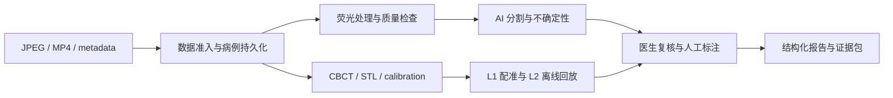

# osteo-vision 工程架构

适用版本：`0.3.0-rc.2`。

## 设计原则

1. 患者安全、医生复核、失效降级和证据追踪优先。
2. 官方 JPEG/MP4 文件输入始终保持可运行。
3. 设备接入通过文件与标准化 manifest 解耦。
4. 目标域数据、医生真值和晋级证据缺失时，代理模型保持研发验证状态。
5. 活动代码、当前文档、生成产物和历史证据分层保存。
6. 性能改动需绑定基准、profiling、回归测试和前后指标。

## 运行分层

### 前端层 `frontend/`

主平台使用 Vue 3、TypeScript、Pinia 和 Vue Router。顶部导航按数据准入、病例档案、病例工作台、三维导航、人工标注与医生复核、报告导出、研发支持入口排列。桌面工作站为当前验收视口。`frontend/three-d-runtime/` 作为独立 Vue/Vite/Three.js 运行时构建、测试和部署，通过版本化场景快照与主平台交换最小渲染数据。

### API 层 `backend/osteo_vision_api/api/`

FastAPI 路由负责输入校验、身份上下文、HTTP 状态、文件流和服务调用。路由层不承载医学算法。

### 应用服务层 `backend/osteo_vision_api/services/`

负责病例分析、视频关键帧、实时帧、荧光融合、医生复核、人工标注、训练准入、导出、医院数据准入、CBCT 建模、静态配准和离线位姿回放。

### 领域与持久化层 `backend/osteo_vision_api/domains/`

Pydantic schema、枚举和 SQLite repository 保存病例、输入、分析任务、复核、人工标注与版本。写入采用乐观并发控制和原子替换。

### 核心算法层 `osteo_vision_core/`

- `osteo_vision_core/models/`：模型 adapter、keyframe 分割、患者条件、骨活性、晋级门。
- `osteo_vision_core/preprocess/`：荧光、图像质量、CT、ROI 和 mask 后处理。
- `osteo_vision_core/io/`：JPEG、MP4、DICOM、NIfTI 和实时流 I/O。
- `osteo_vision_core/navigation/`：坐标契约、刚体配准、离线位姿回放。
- `osteo_vision_core/datasets/`：来源清单、分组切分、训练准入和泄漏检查。
- `osteo_vision_core/metrics/`：分割、分类、校准和性能指标。
- `osteo_vision_core/engine/`：统一推理、实验与 benchmark 入口。

## 配置权威

| 配置 | 用途 |
|---|---|
| `configs/inference/osteo_vision_competition_strict.yml` | 比赛演示和严格运行 |
| `configs/inference/osteo_vision.yml` | 研发、模型清单和安全关闭的代理能力 |
| `configs/tasks/osteo_vision.yml` | 颌骨骨髓炎任务契约 |
| `configs/paths.local.yml` | 本机路径覆盖，Git 忽略 |

模型、阈值、checkpoint、运行许可、目标域状态和回退策略只能通过配置、manifest 与晋级记录进入运行时。

## 两条视频路径

### MP4 文件分析

视频经 ffprobe/解码检查后抽取关键帧，逐帧生成完整证据，并写入帧明细、时序摘要和 video segmentation manifest。该路径强调证据完整性。

### 视频流连续帧分析

浏览器将当前帧缩放到最长边 960，JPEG 编码后串行提交。后端复用已加载模型并返回唯一帧证据路径。上一帧完成后继续下一帧，避免请求积压。该路径保留 mask、风险图、不确定性图、叠加图和端到端延迟。

## 模型运行边界

所有 adapter 通过 `ModelSpec` 描述依赖、输入、任务、checkpoint、设备、运行许可和医学声明。`MedicalImagingInferenceService` 是通用推理入口，病例工作台通过应用服务复用同一 adapter 体系。

比赛严格模式关闭 fixture、缺权重回退、启发式关键帧回退和 prompt fallback。患者条件与骨活性代理 checkpoint 可生成离线工程证据，其目标域替换权限保持关闭。

## 三维安全分级

- `L0`：未配准三维参考。
- `L1`：静态仿体配准工程验证。
- `L2`：离线动态位姿回放工程验证。

来源、单位、坐标 frame、手性、轴方向、矩阵约定、标定、同步、TRE、漂移和医生复核均属于门控条件。任一必要证据失败时结果降级至 L0。

## 数据与产物分层

- 代码与当前文档：Git 跟踪。
- 小型来源清单、许可和下载收据：Git 跟踪。
- 原始患者影像、视频、checkpoint、数据库、密钥、三维模型和大体积派生数据：Git 忽略。
- 本地运行证据：`artifacts/`，按任务和时间生成。
- 历史报告：日期化保留并在索引中标记归档属性。

详细目录规则见 [project_structure.md](project_structure.md)。

## 质量与性能

主要质量门：Ruff、mypy、Black、isort、pytest、Vitest、`vue-tsc`、Vite build、Playwright、严格运行预检和数据 manifest 核验。

性能流程：

1. 固定输入、checkpoint、配置、设备和运行次数。
2. 记录端到端、模型、后处理、I/O 和内存基线。
3. 使用 cProfile、浏览器性能记录或明确静态证据定位热点。
4. 保持输出契约与安全回退。
5. 运行针对性回归和全量质量门。
6. 保存前后对比到 `artifacts/performance/`，摘要进入 release 证据。

## 扩展边界

新增模型需提供 adapter、配置、checkpoint manifest、来源许可、最小测试和运行许可。新增数据需提供来源、许可、患者/样本数量、模态、标签、临床变量、SHA256、下载时间和用途边界。新增临床字段需经过最小必要性、可信来源、缺失值、范围和亚组审计设计。
