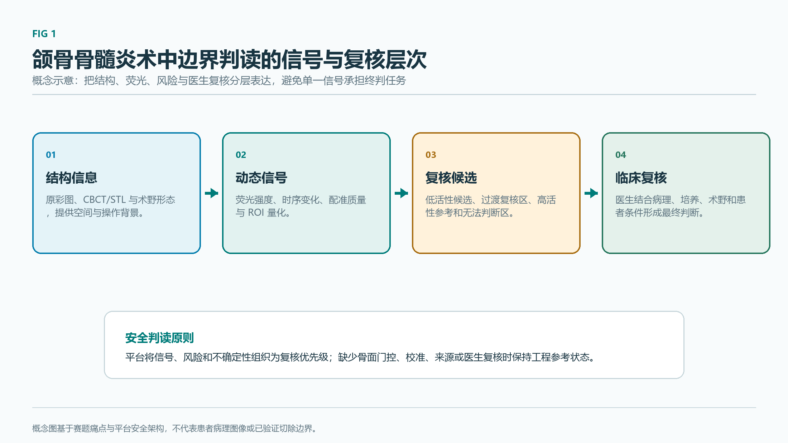

# 第 1 章 项目背景与临床需求

---

## 1.1 颌骨骨髓炎概述

### 1.1.1 流行病学与分型

颌骨骨髓炎（jaw osteomyelitis）是累及颌骨骨皮质与骨髓质的感染性或炎症性疾病，多由牙源性感染扩散、牙外伤、拔牙并发症或颌面部创伤引起，少部分继发于血源性感染、放疗或抗骨吸收药物使用。下颌骨因骨质致密、血供相对单一，发生率高于上颌骨。

依据病因与病程，临床通常将颌骨骨髓炎分为以下类型：

| 分型 | 主要诱因 | 典型病程 |
| --- | --- | --- |
| 急性颌骨骨髓炎 | 牙源性感染、急性创伤 | 起病急，疼痛、发热、局部肿胀显著 |
| 慢性颌骨骨髓炎 | 急性期未彻底控制或反复发作 | 病程迁延，可见瘘管、死骨、间歇性排脓 |
| 继发性颌骨骨髓炎 | 放射治疗后、外伤后、糖尿病等基础病 | 病程复杂，血供与全身状况差 |
| 药物相关性颌骨骨坏死（MRONJ） | 双膦酸盐、地诺单抗等抗骨吸收药物 | 暴露骨面迁延不愈，难愈合并感染 |
| 放射性骨坏死（ORNJ） | 头颈部放疗后骨坏死 | 放疗区域骨坏死伴软组织损伤 |

不同分型在病理机制、治疗策略与术中判读难点上存在差异，共同表现为病灶边界难以精确判定、活性骨与死骨鉴别困难、术后复发风险较高等问题。

### 1.1.2 发病机制

颌骨骨髓炎的发病机制涉及多种因素的叠加作用：

- **感染源**：牙源性感染是急性颌骨骨髓炎最主要的来源，致病菌以葡萄球菌、链球菌和厌氧菌为主，部分病例合并多种菌群感染；
- **血供破坏**：颌骨血供单一，下颌骨主要依靠下牙槽动脉供血，感染、外伤或手术破坏血供后，骨内压力升高、静脉回流受阻，进一步加重骨坏死；
- **药物相关骨坏死**：双膦酸盐、地诺单抗等抗骨吸收药物抑制骨重塑，长期使用可导致局部骨代谢失衡，合并创面或拔牙时诱发颌骨坏死；
- **外伤与放射性因素**：颌面部骨折、放射治疗后骨细胞损伤、血管纤维化等均可破坏骨组织活性，形成继发性骨坏死病灶；
- **免疫与基础病**：糖尿病、免疫抑制、长期糖皮质激素使用等因素可显著降低局部抗感染与愈合能力。

### 1.1.3 临床表现

颌骨骨髓炎的典型临床表现包括：

- 持续性颌面部疼痛，可放射至耳颞区或下牙槽神经分布区；
- 局部肿胀、皮温升高、张口受限；
- 牙齿松动、咬合紊乱、口内或面部瘘管形成，伴有脓性分泌物；
- 受累神经区感觉异常，如下唇或颏部麻木；
- 病程较长者出现面部畸形、病理性骨折、口内外瘘管贯通；
- 影像检查可见骨密度不均、死骨形成、骨膜反应与骨质破坏。

### 1.1.4 病理过程与复核边界示意

*Fig 1 颌骨骨髓炎病理过程与复核边界概念图。图示将结构信息、荧光信号、风险提示和医生复核组织为平台输出层；用于说明研发验证版平台的软件判读框架，未使用患者病理图像或病理边界标注。*

### 1.1.5 现有治疗路径

当前颌骨骨髓炎的治疗遵循"全身支持 + 局部清创 + 缺损修复"的序列治疗原则：

1. **全身抗感染**：根据细菌培养与药敏结果使用抗生素，急性期以广谱抗生素为主，慢性期需结合厌氧菌覆盖；
2. **病灶清创**：彻底清除死骨与炎性肉芽组织，直至暴露出血的健康骨面；清创范围依赖术者经验判断，过度清创可造成骨缺损扩大，清创不足则易复发；
3. **血供重建与软组织覆盖**：对血供破坏严重或大面积骨缺损者，采用局部或游离瓣修复，改善局部血供与软组织覆盖；
4. **序列修复**：包括牙列修复、咬合重建、颌骨重建与种植等后期处理；
5. **基础病管理**：糖尿病血糖控制、抗骨吸收药物停用或调整、营养支持等。

### 1.1.6 核心临床痛点

综合上述流程，颌骨骨髓炎手术存在四类长期未解的临床痛点：

1. **病灶边界不清**：肉眼与影像学难以在术中精确判定死骨与活性骨的过渡边界；
2. **过度清创或清创不足**：过度清创扩大骨缺损、损害颌骨连续性，清创不足则残留感染灶导致复发；
3. **复发率较高**：慢性与继发性颌骨骨髓炎术后复发率仍处于较高水平；
4. **术中实时判读缺位**：传统影像学为术前信息，难以实时反馈术野清创状态与组织活性。

---

## 1.2 当前疾病诊疗方式与不足

### 1.2.1 传统术前评估

传统术前评估以影像学与活检为主：

- **X 线全景片与 CT**：可整体观察骨质破坏范围、死骨形态与骨膜反应，但早期骨髓炎信号弱，分辨率有限；
- **CBCT**：在牙科与颌面外科应用广泛，可提供三维骨质信息，但功能信息有限；
- **MRI**：软组织对比好，可评估炎性水肿与脓肿范围，但对骨皮质细节描述较弱，设备体积与术中可用性受限；
- **活检与细菌培养**：提供病理与微生物学诊断，属于术前或术中切片检查，无法在术野中实时反馈；
- **血液检查**：炎症指标与基础病评估为辅助信息，缺乏局部病灶定位能力。

### 1.2.2 传统术中判读

术中判读主要依赖：

- 术者**肉眼观察**骨面颜色、出血情况、骨质硬度；
- **触诊**判断骨面松软度、死骨松动度；
- **术中 X 线或 CBCT** 复核（条件具备时），需要中断手术、更换体位或推进设备；
- **术中冰冻切片**（条件具备时），耗时较长且取样点有限。

### 1.2.3 存在的主要问题

| 序号 | 问题 | 表现 |
| --- | --- | --- |
| 1 | 影像与术中实时性脱节 | 术前影像难以反映术野清创过程中的实时组织状态 |
| 2 | 死骨与活性骨边界依赖经验 | 肉眼与触诊存在主观差异，过渡区判读一致性有限 |
| 3 | 缺乏定量与可复核指标 | 术中判读结果难以量化、难以追溯，病例证据缺失 |
| 4 | 难以支持术中即时决策 | 缺乏可在术中即时反馈的辅助信号与候选区提示 |

上述不足共同导致颌骨骨髓炎手术在术中边界判定、术中决策与术后证据三个环节缺乏可量化的辅助工具。

---

## 1.3 国内外技术研究现状

### 1.3.1 荧光造影与术中导航

#### 1.3.1.1 ICG 在外科的临床应用与文献证据

吲哚菁绿（ICG）为水溶性三碳菁染料，1956 年起用于临床。其光学特性为最大吸收约 800 nm，发射峰约 835 nm；在近红外光（约 750–810 nm）激发下发射约 830 nm 荧光。ICG 静脉注射后迅速与血浆白蛋白结合，主要存在于血管内，半衰期 3–5 分钟，经肝脏与胆汁快速代谢。

ICG 荧光成像在外科领域已有较广应用，主要包括：血管通畅性与血流方向评估、肿瘤边界识别（如脑胶质瘤血脑屏障破坏区域）、血流灌注动态评估、组织活性判断、淋巴示踪等。赛题方荧光手术显微镜在 ICG 光学窗口上与上述使用场景一致，激发 750–810 nm、发射约 830 nm。

下表汇总了与本项目最相关的 ICG 文献证据：

| 文献 | 场景 | 关键结论 |
| --- | --- | --- |
| EAES 2023 共识 | ICG 荧光成像外科应用 | ICG 荧光成像"有前景、安全、有效"，但"不应作为单一诊断工具" |
| Dhiman 等 2022 系统综述 | 23 项 NIR-ICG 研究、452 例患者 | 系统综述支持 ICG 在术中辅助判读中的潜力，但样本与方法异质性较大 |
| Yoon 等 2019 | ICG 辅助近红外牙科成像 | 首次体内验证 ICG 辅助近红外牙科成像可行性 |
| 显微镜 ICG 视频 AI 语义分割（2022） | 显微镜下 ICG 视频语义分割 | 最接近赛题工程形态的研究 |
| Naraghi 等 2018 | 深部骨感染 | ICG 可显示深部骨感染区域 |
| Goloborodko 等 2024 | 115 例 NSTI 患者 | 存活感染组织均显荧光、坏死组织均无荧光，未在颌骨骨髓炎大样本验证 |
| Kang 等 2019 | ICG 药代动力学 | 提出骨特异性 ICG 药代动力学模型 |

#### 1.3.1.2 ICG 现有不足

赛题官方文档明确指出："ICG 在颌骨骨髓炎手术中容易受炎症、充血、水肿和操作因素影响，不能准确区分病灶组织与潜在活性骨组织"。结合文献证据，ICG 在颌骨骨髓炎场景下的局限可归纳为：

- **机理局限**：反映血流灌注、血管通透性与组织活性差异，缺乏颌骨骨髓炎特异性结合；
- **边界区分有限**：坏死骨与活性骨的对比主要依赖灌注差，炎症充血区亦呈高信号；
- **早期信号弱**：给药后早期局部信号弱，受背景与噪声影响；
- **单一诊断不足**：临床共识不推荐作为单一诊断工具；
- **颌骨证据规模有限**：现有颌骨近域证据以小样本与近域场景为主。

#### 1.3.1.3 替代与增强方向

为弥补 ICG 在骨活性判读上的不足，文献中已提出多种替代或增强方向：

- **四环素类骨结合荧光**：四环素类抗生素与钙结合，在活跃矿化与骨重塑区域沉积，活骨呈明亮绿色或黄绿色荧光，坏死骨呈低荧光或无荧光。激发波段 405–460 nm 紫蓝光，发射峰值约 529 nm，集中在 500–560 nm。相关文献包括 Pautke 2010、Ristow 2017 与 2020，以及 MRONJ 荧光引导手术荟萃分析（285 名患者、314 个病灶）；
- **自体荧光**：骨组织在紫外/紫蓝光激发下产生的内源性荧光，可作为无造影剂的活性参考信号；
- **Evans blue 通透性示踪**：与血清白蛋白结合，反映血管通透性与蛋白渗漏，可作为炎性软组织通透性参考，原始产品在临床已停产。

上述方向的光谱、机理与临床可得性存在差异，难以单独替代 ICG，因此本项目采用"ICG 灌注基线 + 第二信号补充 + 模块化新型探针设计"的组合思路，详见第 3 章。

### 1.3.2 医学图像智能分析

#### 1.3.2.1 多模态融合

医学图像分析已从单一模态向多模态融合演进，结构信息（CT、CBCT、白光图像）与功能信息（荧光、灌注、自体荧光）的联合分析成为术中辅助判读的重要方向。颌骨骨髓炎场景下，白光通道提供解剖结构、ICG 通道提供灌注与血管通透性信息、四环素/自体荧光提供骨活性参考，三者融合可形成多层级信号组合。

#### 1.3.2.2 模型与任务演进

| 维度 | 演进路径 |
| --- | --- |
| 网络结构 | CNN → Transformer → Mamba 等 SSM 架构；医学图像分割领域出现 nnU-Net、MedNeXt、U-Mamba、MedSAM、SAM2 等代表工作 |
| 任务粒度 | 分类 → 检测 → 分割 → 不确定性提示 → 多任务联合 |
| 输入形态 | 单帧 2D → 帧序列 → 视频 → 多模态配准输入 |
| 输出契约 | 单一分类 → 多掩膜分割 → 概率图 → 候选区 + 风险图 + 不确定性图 |

#### 1.3.2.3 当前空白与本项目切入点

结合上述现状，颌骨骨髓炎术中荧光辅助判读领域存在三方面明显空白：

1. **术中实时性不足**：现有研究多停留在离线图片或离线视频分析，术中实时反馈链路较弱；
2. **目标域数据稀缺**：真实术中颌骨骨髓炎 ICG 视频与医生标注样本极度缺乏，公开数据集多为近域或代理数据；
3. **医生交互闭环弱**：现有 AI 模型输出缺乏医生复核、修改与回灌训练的可控链路。

本项目的切入点在于：构造"造影剂设计 + 多模态融合 + AI 判读 + 医生复核"的完整方案，在赛题官方 4K JPEG/MP4 输入边界下实现端到端可运行闭环，并通过医生复核回灌与证据包导出支撑后续临床验证。
