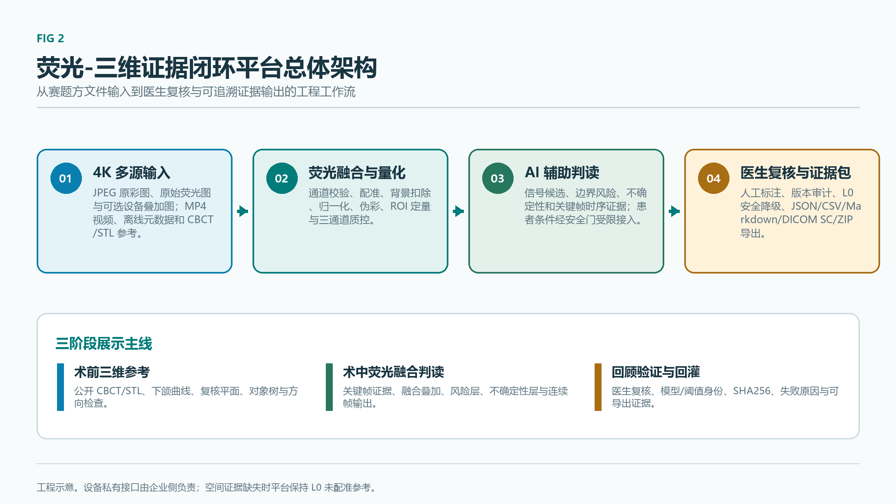

# 第 2 章 总体技术方案设计

---

## 2.1 系统总体架构

### 2.1.1 总体设计原则

本系统总体设计遵循以下原则：

- **以患者安全为第一**：所有创新点先完成风险识别、医生复核边界、失效保护与不可声称范围定义，再进入比赛展示与后续验证；
- **设备解耦**：平台软件与硬件设备解耦，仅处理官方 JPEG/MP4、三路图像文件及可选标准化元数据进入软件后的分析、复核、证据与安全降级（详见 2.1.7）；
- **配置与契约驱动**：模型、数据集、阈值、坐标约定、复核流程与输出契约统一通过配置文件与清单进入工程；
- **可复核与可追溯**：病例准入、模型推理、医生复核与回灌训练全过程保留证据链与版本历史。

### 2.1.2 硬件层：赛题方荧光手术显微镜

赛题方荧光手术显微镜参数如下（来源：赛题官方技术文档）：

| 参数类别 | 规格 |
| --- | --- |
| 摄像系统 | 4K 超高清影像摄录系统，分辨率 3840×2160 |
| 影像存储 | USB3.0；图片 JPEG，视频 MP4 |
| 放大倍率 | 电动/手动 6.2:1 连续变倍；总放大倍 1.3×–17× |
| 视场直径 | 14–190 mm |
| 工作距离 | 200–630 mm，变焦范围 430 mm |
| 照明 | 300W 高亮氙灯，色温 5900K，CRI>90，照度>120000 lux |
| ICG 光学窗口 | 激发 750–810 nm，发射约 830 nm |
| 三路输出（2026-07-17 沟通新增） | 原彩图、荧光图、叠加图 |

平台软件的一级输入为 4K MP4 视频文件与 JPEG 图片文件；设备驱动、SDK 与采集卡接口由企业负责，不在本项目软件开发与比赛版交付范围内。涉及倍率、工作距离、相机标定、坐标变换与位姿记录等字段时，平台支持文件元数据、人工录入或离线清单接入，不依赖企业私有接口。

### 2.1.3 平台软件层：三层结构

平台软件在双通道数据进入系统后承担后三层任务，各层职责与关键能力如下：

| 层次 | 主要职责 |
| --- | --- |
| 荧光分析层 | 白光/ICG 双通道配准、伪彩、融合、归一化、质控、ROI 定量、时间序列分析 |
| AI 与医生交互判读层 | 候选区、边界风险、不确定性提示、骨活性分层、医生复核与人工标注 |
| 结果输出层 | 关键截图、结构化数据、量化表格、Markdown 报告、病例证据包与 DICOM 扩展 |

#### 2.1.3.1 荧光分析层关键能力

白光与荧光双通道融合模块实现白光与荧光双通道的十步融合链，包括尺寸对齐、背景扣除、相位相关平移配准、百分位归一化、伪彩映射、白光叠加、色标生成、ROI 定量与报告输出，并对输出图像、掩膜、热图与色标建立唯一证据路径。三路输出质控模块对赛题方原彩图、荧光图与叠加图三路输出执行一致性、通道关系与时间戳质控。

#### 2.1.3.2 AI 与医生交互判读层关键能力

AI 推理由统一推理服务调度，模型通过适配器接口注册进入。术中视频分割按"视频信号分割"任务定位：暴露骨区域、荧光/灌注信号、时间稳定性、边界风险与不确定性提示的组合，不直接包装为疾病终判掩膜。该层输出四类掩膜与一个连续评分：

| 输出契约 | 含义 | 标注来源 |
| --- | --- | --- |
| 骨面门控掩膜 | 暴露骨面或疑似骨面 | 医生或提示辅助复核（无医生/SAM 辅助前标注"待复核"） |
| 荧光信号掩膜 | 高荧光/灌注信号候选 | 可训练或启发式代理 |
| 边界风险掩膜 | 边界风险提示 | 可训练或启发式代理 |
| 不确定性掩膜 | 低置信或质量受限区域 | 质量或复核信号 |
| 骨活性连续评分 | 0–1 信号参考值 | 复核候选 |

医生复核回灌通过人工标注与复核服务实现：人工标注支持画笔、橡皮擦、多边形、撤销/重做、缩放、标签选择、草稿保存、提交复核与版本历史；医生复核状态分为"通过"、"修改"、"驳回"与"待复核"四类，对应不同训练准入权重。后端持久化字段覆盖原图尺寸坐标、像素掩膜、标注类别、医生身份、机构、时间、来源输入、版本、复核状态与训练准入状态。

#### 2.1.3.3 结果输出层关键能力

平台报告模块聚合病例记录、分析运行、临床上下文评估、患者条件证据、骨活性证据、视频信号分割、三路质控、三维证据、ROI、复核事件与产物列表，输出结构化报告并嵌入平台安全免责声明与 ICG 信号局限性说明。其余模块分工为：量化表格模块输出 ROI 量化表、Markdown 报告模块输出可读报告、DICOM Secondary Capture 模块输出证据截图扩展、证据包整合模块打包为 ZIP 病例证据包（附带模型、配置、阈值、SHA256、身份与复核状态）。

### 2.1.4 用户与医生侧

平台面向主刀医生（确认边界、调整阈值、接受或修改 AI 建议、双签晋级）、术中助手（导入图像或帧序列、选择关键帧、补充术中备注）、科研人员（回看病例、导出证据包、批量统计与模型评估）与平台管理员（配置模型版本、报告模板、导出格式与权限）四类角色提供工作流。

### 2.1.5 数据闭环与端到端演示

平台采用"病例准入 → 模型推理 → 医生复核 → 回灌训练"四阶段闭环：

1. **病例准入**：医院或医生交接的真实 JPEG/MP4 在写入病例前执行批次准入，记录机构授权、脱敏、用途范围与接收信息，校验文件签名、可解码性、SHA256、重复项、通道关系与同步配对；只有通过准入的文件登记为病例输入，被隔离的文件仅保留原因码；
2. **模型推理**：4K JPEG/MP4 进入平台后执行配准、伪彩、融合、归一化、质控、ROI 定量与关键帧/连续帧分割推理，输出四类掩膜、骨活性连续评分与候选区；
3. **医生复核**：医生对 AI 候选区进行复核、修改或驳回，状态由"通过/修改/驳回/待复核"区分；只有可信医生身份提交且完成独立复核的标注进入高权重训练评估；
4. **回灌训练**：通过或修改后的样本作为高权重训练数据，驳回样本作为负例或错误分析数据，训练报告须说明权重仍不等同于真实目标域临床标注。

端到端演示闭环串起上述阶段：录入脱敏病例 → 导入 4K JPEG/MP4 → 自动配准/伪彩/融合/归一化/质控/ROI 定量 → 4K 分块关键帧分割 + 连续帧实时叠加 → 输出四类掩膜与骨活性连续谱 → 医生复核/人工标注/版本审计/双签晋级 → 导出 JSON+CSV+Markdown+DICOM SC+ZIP 证据包 → 三维工作台 L1/L2 工程验证。

*Fig 2 荧光-三维证据闭环平台总体架构。图示归纳赛题文件输入、平台处理、医生复核与证据输出之间的工程关系；空间证据不足时平台保持 L0 未配准参考。*

### 2.1.6 设备解耦与元数据接入

平台软件保持设备解耦：硬件层、厂商 SDK、硬件接口、倍率/工作距离实时读取与设备侧驱动适配均由企业负责。涉及倍率、工作距离、同步、配准等字段时，平台支持三种接入方式——文件元数据（EXIF/自定义 chunk/伴随清单）、人工录入（前端录入界面）与离线清单（YAML/JSON 病例级或帧级元数据）。企业无法提供接口时不得作为软件缺口或阻塞项；平台在缺少上述字段时仍可运行，并将输出降级为未配准三维参考状态。

### 2.1.7 技术栈与配置入口

平台固定技术栈包括 Python 3.11、TypeScript + Vue 前端、FastAPI 后端、PyTorch 核心 ML 后端、SimpleITK/nibabel/pydicom 医学影像 I/O、OpenCV/Pillow/matplotlib 2D 处理、numpy/pandas/scikit-learn 数据分析、YAML 配置、pytest/mypy/ruff/black/isort 质量门控与 Gradio 临时演示。

颌骨骨髓炎专用逻辑通过任务包配置（定义输入契约、标签契约与视频信号分割掩膜集）与推理配置接入共享层。模型与数据集保持可变，仅通过配置、适配器、清单与实验记录进入工程。

### 2.1.8 三维导航能力分级

显微镜倍率与工作距离可参与尺度估计与动态相机参数选择。完整导航需患者-CBCT 配准、相机位姿、深度或已知几何、坐标变换、同步、TRE、漂移与失效回退。平台按四级表达：

| 级别 | 含义 | 当前状态 |
| --- | --- | --- |
| L0 | CBCT/STL 未配准参考与候选区证据 | 可运行 |
| L1 | 下颌仿体静态配准，记录 FRE、TRE、标定与坐标契约 | 软件链可运行，物理精度未完成 |
| L2 | 离线位姿回放，记录重投影、同步、漂移与失效注入 | 软件链可运行，物理精度未完成 |
| L3 | 真实术中实时定位 | 待前置条件齐备后再进入 |

界面与报告显示 L0 安全状态；任一导航门失败时降级为 L0 未配准三维参考。
