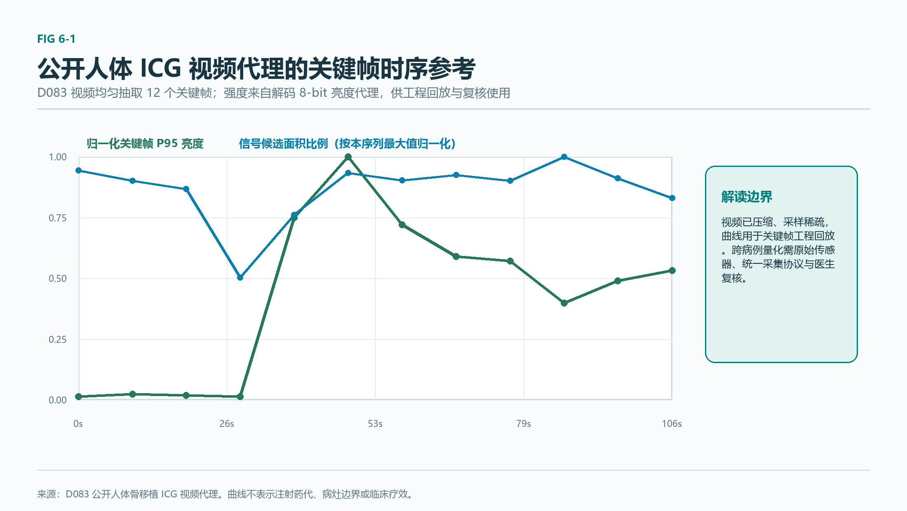
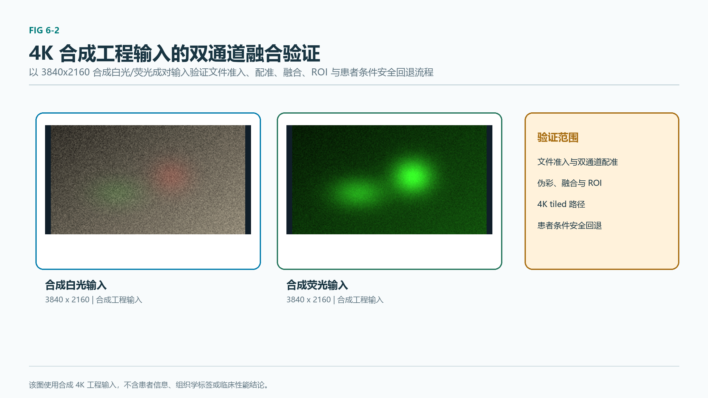
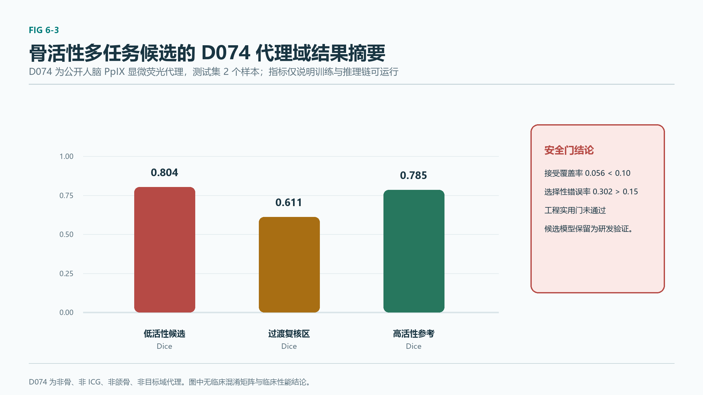
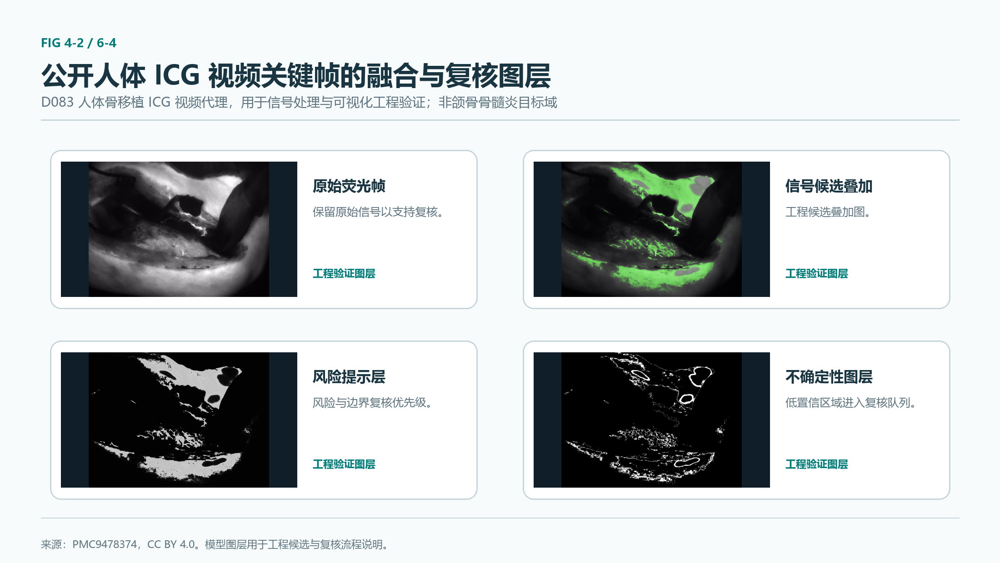
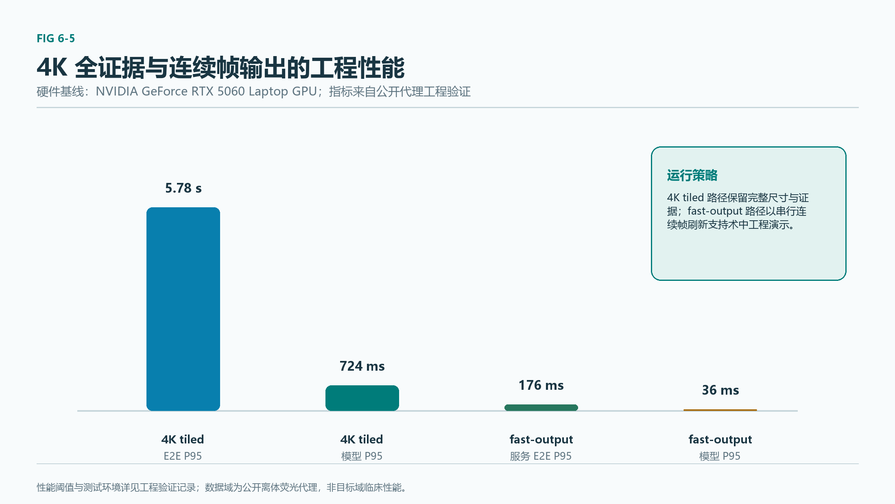
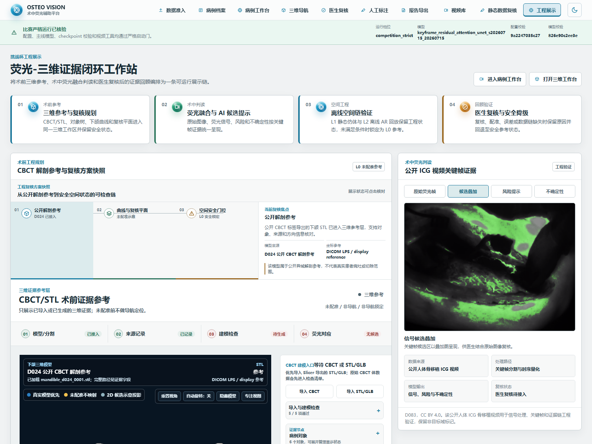

# 第 6 章 实验设计及结果验证

---

## 6.1 实验过程

### 6.1.1 数据来源分层

平台软件按"目标域 / 公开代理 / 异域代理 / 合成"四层组织数据来源，所有进入实验的样本均需通过批次准入并写入分层数据注册表。当前分层数据注册表共记录 504 条，质量门通过、错误 0、警告 63；目标域记录 0；可进入训练准入检查 393 条；隔离缺失文件 3 条。分层统计为合成代理 393 条、荧光代理 56 条、近域 55 条。标签统计为自动种子掩膜 9 条、提示辅助掩膜 1 条、代理掩膜 392 条、无标签 102 条。所有训练指标均属于非目标域工程证据。

各数据集的来源与用途边界如下表所示：

| 数据集 | 名称 | 模态 | 规模 | 用途边界 |
|---|---|---|---|---|
| 公开 CBCT-1 | DentVoxel | CBCT | 38 结构实例标注 | 三维颌骨/牙齿分割预训练；第一任务下颌感兴趣区（0–6 少类标签），第二任务全 39 类；不含骨髓炎、坏死骨或 ICG 荧光标签 |
| 公开 CBCT-2 | 牙源性病灶 CBCT + 病理 | CBCT + 病理 | 209 训练 + 53 验证（64³ ROI 缓存） | 病灶分类/分割代理；最接近骨髓炎任务的代理数据；当前保持非目标域、训练未晋级 |
| 公开 CBCT-3 | ToothFairy2 | CBCT | 417+63 卷，42 类解剖结构（MICCAI 2024） | 三维颌骨/牙齿多结构分割预训练；当前三维颌骨专用分割效果验证优先公开数据；公开异域解剖分割数据 |
| 公开荧光代理-1 | 离体鸡腿模拟荧光手术视频 | 鸡腿模拟荧光手术 MP4 | 192 个清单样本，采样 2560 帧跨 28 个视频来源组 | 关键帧主线与实时快速路径的主要训练/测试源；公开离体非目标域荧光代理 |
| 公开荧光近域-1 | 颌骨荧光论文图 | 论文原图 | 4 篇开放全文，10 张原图；近域 46 | 8 张开放授权进入人工复核队列、2 张仅供参考；像素级医生标注 0、训练候选 0；目标域记录 0 |
| 公开荧光近域-2 | 开放临床骨荧光近域资产 | 论文原图 + 工程面板 | 18 张可追溯原图（7 篇开放授权论文），15 张进入弱标签复核种子 | 含人体颌骨放射性骨坏死/药物相关性骨坏死荧光手术图 2 张、人体口腔邻域荧光手术图 7 张、大动物颌骨代理 4 张、机制参考 3 张；当前可直接训练 0 张 |
| 公开 CT | KiTS23 | CT + 临床结构化变量 | 5 例 | 患者条件分割代理（30/10/10 切分，50 张 2D 切片，288 训练批次） |
| 公开显微荧光 | 5-ALA/PpIX 人脑显微荧光 | 显微荧光 | 5 样本，3 患者，训练/验证/测试 = 1/2/2 | 骨活性多任务代理训练与评估 |
| 公开 CBCT-4 | 牙列标志点 | CBCT + 标志点 | 24 例 | L1 静态仿体配准代理验证 |
| 公开 RGB-D | C3VD | RGB/深度 + 位姿 | 766 帧、2558 位姿 | L2 离线动态 AR 代理验证 |
| 公开数字仿体 | 公开参考下颌模型 | STL/数字仿体 | 6 帧 | L1/L2 工程验证仿体 |
| 其他公开资产 | 肝癌栓塞分割、非小细胞肺癌影像学、头颈放射学等受控资产；颌骨荧光论文图；骨移植 ICG 视频（1024×768、29.97 FPS、105 s）；人体 ICG 手术视频；下颌管分割；放射性骨坏死临床变量（53+1129 例）等 | 多模态 | 各异 | 公开/受控代理；当前训练准入标记为否 |

### 6.1.2 数据清单与可追溯

所有外部数据集下载、本地导入与生成均同步写入可追溯清单，至少记录：原始页面链接、直接下载链接、本地路径、来源、许可、荧光/非荧光属性、医学场景、文件大小、SHA256、校验状态、下载时间、用途边界。大型视频与模型权重只放 Git 忽略的本地原始数据目录，不进入版本库；论文 PDF、官方赛题原文、企业资料、模型权重、DICOM/NIfTI 原始数据同样不进入 Git。

医院或医生交接的真实 JPEG/MP4 在写入平台病例、进入分析或形成训练清单前，必须经过批次准入：记录机构授权、脱敏确认、病例映射保管、用途范围、来源、接收人与时间，校验文件签名、可解码性、SHA256、重复项、通道关系和同步配对。只有通过准入的文件可以登记为病例输入；被隔离的文件仅保留原因码。所有新准入样本默认标记为"待复核""无标签""训练准入否"，直至医生复核及训练准入评估完成。

### 6.1.3 训练与验证策略

**患者级切分**：所有数据集采用患者级分组切分，同一患者的所有帧/切片只能进入训练集或验证/测试集之一，防止同一患者跨集泄漏。切分完成后执行患者级泄漏检查，任何跨集患者 ID 重叠即判为切分失败。

**训练准入与样本权重**：训练准入权重按医生复核状态分级——通过 4.0、修改 4.0、驳回 0.5、待复核 1.0。训练清单同时校验机构训练授权、显式训练用途、脱敏确认、病例映射表机构保管、批次状态、来源输入准入、SHA256。训练范围拒绝标记会拒绝包含"仅分析 / 仅竞赛 / 排除训练 / 无训练 / 仅验证"的样本进入训练清单。当前训练准入记录为 0，与目标域数据缺失状态一致。

**协议统一**：模型选型对比必须在相同数据清单、来源分组切分、预处理与评价协议下运行多个可复现候选，至少记录 Dice、IoU、召回率、精确率、空掩膜率、过分割率、校准、推理延迟和显存/内存占用。每个候选必须产出配置、模型权重、清单、阈值扫描与中英文对比报告，只有在独立测试集上超过当前主线且通过严格运行门控后才能申请替换比赛配置。

### 6.1.4 对照与消融设计

实验对照与消融按四条轴线组织：

1. **模型架构对照**：在公开离体荧光代理锁定测试集上对 ConvNeXt U-Net 基线、多尺度深度可分离 U-Net、残差注意力 U-Net 三族候选完成同协议选型，控制数据清单、切分、预处理、阈值扫描协议一致，仅替换模型家族。
2. **运行路径对照**：4K 分块全证据路径与连续帧实时路径共享同一模型权重与同一四类掩膜输出契约，对照模型 P50/P95、端到端 P50/P95、显存占用，验证双路径一致性。
3. **目标域 vs 代理域分层**：所有掩膜预测结果按来源域分层评估，显式区分目标域、公开代理域、异域代理域，禁止跨域汇总成单一指标。
4. **安全门控对照**：患者条件模型在公开 CT 代理测试集上同时报告无伤害门、亚组门、物理边界门三项独立门控，任一失败即强制空间效应不应用、差异掩膜全零，概率回退为影像基础。

---

## 6.2 实验验证

### 6.2.1 荧光造影剂：公开文献与仿真数据

赛题方显微镜 ICG 光学窗口为激发 750–810 nm、发射约 830 nm。本章造影剂验证以"公开文献证据 + 仿真数据 + 工程替代方案"三类来源支撑，未开展实物合成或人体给药演示。

**公开文献证据**：

- ICG 为水溶性三碳菁染料，最大吸收约 800 nm，发射峰约 835 nm，半衰期 3–5 分钟；EAES 2023 共识将组织灌注评估最低剂量定为 2.5–10 mg，推荐 0.25–0.5 mg/kg。
- Naraghi 等 2018 显示 ICG 可显示深部骨感染区域；Goloborodko 等 2024 在 115 例坏死性软组织感染患者中发现存活感染组织均显荧光、坏死组织均无荧光，但该结论未在颌骨骨髓炎大样本中验证。
- Dhiman 等 2022 系统综述覆盖 23 项近红外 ICG 研究、452 例患者；Yoon 等 2019 首次体内验证 ICG 辅助近红外牙科成像可行性。
- 候选 Evans blue（血管通透性示踪）与四环素类（骨结合自体荧光）作为 ICG 之外的第二信号文献路线，详见第 3 章。

**工程数据**：平台软件对白光/ICG 双通道输入执行配准、归一化、伪彩和定量，输出荧光强度曲线、ROI 时序曲线和灌注/活性比值。4K 合成工程验证实例使用 3840×2160 白光 + ICG JPEG，配准响应 0.366592（安全门 0.08），用于核验官方格式尺寸下的输入、融合、ROI 统计和患者条件安全回退链路。公开人体骨移植 ICG 视频用于关键帧时序量化与回放验证。

*Fig 6-1 公开人体骨移植 ICG 视频代理的关键帧时序参考。图示用于关键帧、相对荧光变化与复核窗口的工程验证；来源、数据域和候选区均须保留在证据清单中，非颌骨骨髓炎目标域。*

*Fig 6-2 4K 合成工程输入。图示白光/ICG 成对文件、融合与 ROI 量化、患者条件安全回退状态；未赋予组织学类别。*

### 6.2.2 病灶识别：代理模型结果与典型案例可视化

主线关键帧分割模型为残差注意力 U-Net 架构，参数量约 40 万、运行阈值 0.4，在公开离体荧光代理测试集上的锁定指标如下：

| 指标 | 主线单种子 | 三种子均值 ± 标准差 |
|---|---:|---:|
| Dice | 0.917681 | 0.914894 ± 0.004139 |
| IoU | 0.848335 | 0.8435 ± 0.0071 |
| 召回率 | 0.9099 | — |
| 空掩膜率 | 0 | — |
| 过分割率 | 0 | — |

骨活性多任务 v2 候选在公开显微荧光代理测试集上的三类混淆归一化结果（仅在验证集扫描骨面门控阈值 0.225、弃权阈值 0.86 后冻结到测试集）：

| 类别 | Dice | 备注 |
|---|---:|---|
| 低活性 | 0.803579 | 代理域 |
| 过渡 | 0.610677 | 代理域 |
| 高活性 | 0.784935 | 代理域 |
| macro Dice | 0.733064 | 代理域汇总 |
| 连续评分 MAE | 0.131430 | 0–1 灰度 |
| 骨面 Dice | 0.102190 | 骨面泛化缺口 |
| 接受覆盖率 | 0.056417 | 预设 ≥0.10 失败 |
| 选择性错误率 | 0.301527 | 预设 ≤0.15 失败 |

工程实用门未通过、目标域晋级不允许、运行时替换不允许。

*Fig 6-3 骨活性多任务候选的代理域结果摘要。图示低活性候选、过渡复核区和高活性参考的代理 Dice，以及工程实用门未通过的结论；代理数据为公开人脑 PpIX 显微荧光代理，非骨、非 ICG、非颌骨、非目标域。*

*Fig 6-4 公开人体 ICG 视频代理的关键帧可视化。原始荧光、候选叠加、风险和不确定性图层用于复核流程与输出契约验证；目标域标记为否。*

### 6.2.3 实时导航：FPS 测试与延迟分布

平台严格区分"有效帧率"与"采样率"，所有实时性指标在两条路径上分别测量：

| 路径 | 模型 P50 (ms) | 模型 P95 (ms) | 服务 E2E P50 (ms) | 服务 E2E P95 (ms) | 峰值显存 (MB) |
|---|---:|---:|---:|---:|---:|
| 4K 分块全证据 | 415.683 | 724.432 | 2181.523 | 5776.683（约 5.78 s） | 723.579 |
| 连续帧实时 | 34.368 | 36.377 | 154.685 | 176.457 | 380.134 |

**对照上一版 ConvNeXt 主线**：

- 4K 运行门控：当前残差注意力候选模型 P50/P95 415.683 / 724.432 ms、端到端 P50/P95 2181.523 / 5776.683 ms、显存 723.579 MB；上一版 ConvNeXt 模型 P50/P95 515.397 / 800.159 ms、端到端 P50/P95 2252.741 / 5775.993 ms、显存 656.318 MB。候选相对变化为模型 P50 −19.347%、模型 P95 −9.464%、端到端 P95 +0.012%、显存 +10.248%。
- 连续帧实时运行门控：当前生产残差注意力服务 E2E P95 176.457 ms、模型 P95 36.377 ms；上一版 ConvNeXt 主线服务 E2E P95 182.601 ms、模型 P95 59.531 ms；当前生产相对变化为服务 E2E P95 −3.365%、模型 P95 −38.894%。

**门控上限**：端到端 P95 ≤ 15 s、模型 P95 ≤ 3 s、显存 ≤ 2048 MB、前景比例 0.0001–0.6。当前主线在两条路径上均通过门控。

**导航 L1/L2 工程验证**：

- L1 静态仿体配准：采用 Kabsch SVD 与相机位姿求解迭代法；无噪声合成 FRE 1.43e-14 mm、TRE 1.68e-14 mm；公开牙列基准 0.5/1/2 mm 噪声下 TRE 0.352 / 0.772 / 1.625 代理 mm；L1 相机位姿拟合 RMSE 0.2234 px、独立 RMSE 0.2990 px。
- L2 离线动态 AR：采用 PTS 严格递增与恒定帧率校验；9 项安全参数（最大时间偏移 50 ms、漂移阈值 1.0 mm、TRE 代理阈值 2.0 mm 等）；公开 RGB-D 代理 766 帧绑定、2556 位姿、最大时间差 9.693 ms、24 帧受控回放。
- 公开数字下颌仿体：L1 FRE 2.93e-14 mm、TRE 2.34e-14 mm、重投影 6.23e-14 px，6/6 帧 L2 软件门通过。
- 所有 L1/L2 工程结果当前保持导航就绪标记为否、导航声称允许标记为否。

*Fig 6-5 两条推理路径的 P95 性能。指标来自公开离体荧光代理工程验证，硬件基线为 NVIDIA GeForce RTX 5060 Laptop GPU。*

*Fig 6-6 平台中的公开人体 ICG 视频代理回放工作区。关键帧候选叠加与未配准三维参考在同一工程展示页呈现；关键帧同步、PTS 严格递增和来源记录由相应视频分割清单留存。图中数据保持目标域标记为否、导航就绪标记为否。*

### 6.2.4 模型测试 / 消融实验

**模型选型对比（同协议，全部代理测试集非目标域）**：

| 模型 | 参数量 | 平均训练损失 | 锁定测试集 Dice | 锁定测试集 IoU | 召回率 | 4K 模型 P95 (ms) | 4K 显存 (MB) | 门控 |
|---|---:|---:|---:|---:|---:|---:|---:|---|
| ConvNeXt U-Net 基线 | — | — | 0.8987 ± 0.0000 | 0.8164 | 0.8908 | 800.159 | 656.318 | — |
| 多尺度深度可分离 U-Net | 29,414 | 0.2974 | 0.8978 ± 0.0113 | 0.8149 ± 0.0183 | 0.8933 | 4.25 | 20.14 | 保持 |
| **残差注意力 U-Net（主线）** | **403,785** | **0.1872** | **0.917681** | **0.848335** | **0.9099** | **724.432** | **723.579** | **通过** |

**公开 CBCT 病灶代理模型对比（非目标域）**：

| 模型 | 参数量 / 续训批次 | 阈值 | Mean Dice | IoU | HD95 | NSD | Sensitivity | Precision | 状态 |
|---|---:|---:|---:|---:|---:|---:|---:|---:|---|
| ConvNeXt 风格续训 | 4500 batch | 0.20 | 0.6567 | 0.5553 | 15.2370 | 0.4797 | 0.6900 | 0.7238 | 本地冒烟主线 |
| MONAI SegResNetDS | 3,154,514 | — | 0.5741 | 0.4766 | — | — | — | — | 对照基线，未接入推理配置 |

**患者条件代理训练（公开 CT，5 例）**：

| 指标 | 数值 | 门控结论 |
|---|---:|---|
| 代理测试集条件 Dice | 0.243974 | — |
| 影像基础 Dice | 0.244188 | — |
| 条件减影像基础 Dice 差 | −0.000214 | 无伤害门接近 0 |
| 召回率 | 0.195572 | — |
| 精确率 | 0.553163 | — |
| IoU | 0.151192 | — |
| ECE | 0.005700 | 校准良好 |
| 最大物理边界位移 | 183.478281 mm | 远超 2 mm 临时门 |
| 无伤害门 | 失败 | Dice 差为负 |
| 亚组门 | 失败 | 最差代理亚组 Dice 差为负 |
| 物理边界门 | 失败 | 183.48 mm 远超 2 mm |
| 目标域晋级 | 不允许 | — |
| 运行时替换 | 不允许 | — |
| 临床声称 | 不允许 | — |

**骨活性多任务代理训练（公开显微荧光，5 样本 3 患者 训练/验证/测试 = 1/2/2）**：

| 指标 | 数值 | 预设约束 / 结论 |
|---|---:|---|
| macro Dice | 0.733064 | 代理域 |
| 低活性 Dice | 0.803579 | 代理域 |
| 过渡 Dice | 0.610677 | 代理域 |
| 高活性 Dice | 0.784935 | 代理域 |
| 连续评分 MAE | 0.131430 | 代理域 |
| 骨面 Dice | 0.102190 | 骨面泛化缺口 |
| 接受覆盖率 | 0.056417 | 预设 ≥0.10 失败 |
| 选择性错误率 | 0.301527 | 预设 ≤0.15 失败 |
| 工程实用门 | 未通过 | — |
| 目标域晋级 | 不允许 | — |
| 运行时替换 | 不允许 | — |

**Table 6-1 掩膜预测结果（代理域 vs 目标域分层）**：

| 域 | 测试集 | Dice | IoU | 召回率 | 空掩膜率 | 过分割率 | 备注 |
|---|---|---:|---:|---:|---:|---:|---|
| 公开代理域 | 公开离体荧光代理（主线） | 0.917681 | 0.848335 | 0.9099 | 0 | 0 | 关键帧主线，单种子 |
| 公开代理域 | 公开离体荧光代理（三种子） | 0.914894 ± 0.004139 | 0.8435 ± 0.0071 | — | — | — | 三种子稳定性 |
| 异域代理域 | 公开 CT（患者条件） | 0.243974 | 0.151192 | 0.195572 | — | — | 无伤害/亚组/边界门失败 |
| 异域代理域 | 公开显微荧光（骨活性 macro） | 0.733064 | — | — | — | — | 覆盖率/选择性错误率失败 |
| 异域代理域 | 公开 CBCT 病灶代理 | 0.6567 | 0.5553 | 0.6900 | — | — | HD95 15.24 mm |
| 目标域 | 真实术中 ICG 颌骨骨髓炎 | — | — | — | — | — | 目标域记录 0，未测量 |

### 6.2.5 4K 工程验证实例端到端验证

4K 合成工程验证实例输入 3840×2160 白光 + ICG JPEG，配准响应 0.366592（安全门 0.08）。该实例的工程临床上下文触发患者条件安全门，基础概率与患者条件概率逐字节一致、差异掩膜全零、空间效应不应用。该结果验证了 4K 输入边界、配准质量门、患者条件无伤害回退与四类掩膜输出契约的端到端可运行性。

