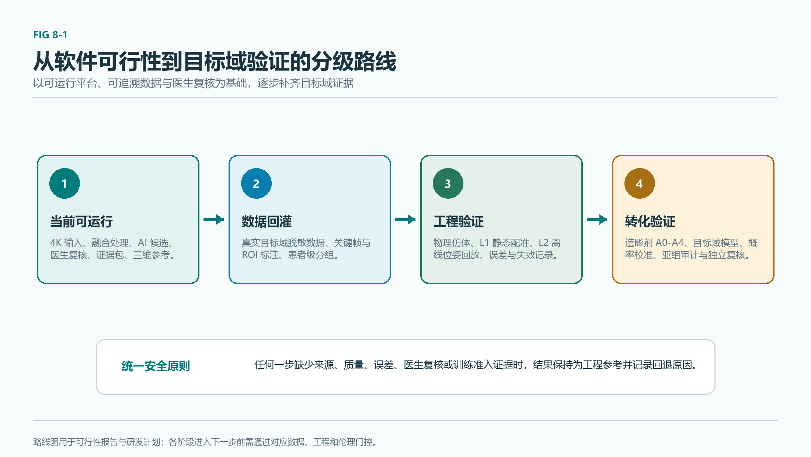

# 颌骨骨髓炎智能化荧光诊疗平台可行性报告（精简提交版）

版本：挑战杯可行性报告与软件展示版  
日期：2026-07-22  
项目定位：面向荧光手术显微镜的颌骨骨髓炎术中辅助决策平台软件

> 患者安全边界：本报告中的图像、量化指标、AI 候选区、三维参考和工程验证均属于研发验证证据与医生复核辅助。平台不输出自动诊断、自动切除或真实术中导航结论；最终判读由具备资质的医生结合术中所见、影像、病理和微生物学结果完成。

## 摘要

颌骨骨髓炎、药物相关性颌骨骨坏死和放射性骨坏死的术中处理，面对病灶边界难辨、组织活性变化连续、清创范围难以量化和证据留存不足等问题。白光显微图像提供术野结构，ICG 荧光提供灌注、血管通透性和组织活性相关信号，两类信号可形成互补参考；单一荧光信号仍受炎症充血、给药时相、曝光和组织深度影响，必须进入医生复核流程。

本项目面向赛题方荧光手术显微镜的 4K JPEG/MP4 文件输入边界，构建“术前数字化规划—术中多模态融合与 AI 复核—术后证据回顾”的完整平台软件闭环。平台通过白光/荧光配准、伪彩增强、三通道质控、候选区与不确定性提示、医生标注复核、CBCT/STL 三维参考、结构化报告和证据包导出，把离散的术前影像、术中视频与复核结果组织为可追溯工作流。

当前工程已完成公开数据、公开视频代理和数字仿体上的可运行验证：4K tiled 全证据路径服务端端到端 P95 为 5776.683 ms，连续帧 live_fast 路径服务端端到端 P95 为 176.457 ms；公开离体荧光代理数据上的主线分割模型 Dice 为 0.917681、IoU 为 0.848335；D036 公开颌骨解剖参考用于三维表面与空间工程验证，D083 公开人体 ICG 骨移植视频用于多模态视频流程验证。上述数据均不属于真实术中 ICG 颌骨骨髓炎目标域，指标仅说明工程实现和方案可行性。

报告完整回答赛题三项要求：提出可由团队造影剂综述进一步替换与扩展的候选造影剂设计框架；给出白光与荧光多模态融合处理方案；给出基于人工智能的候选区识别、风险提示和医生复核方案。平台以设备解耦、分级导航、失效降级、数据准入和可追溯证据为安全底座，为后续真实目标域数据、湿实验、仿体验证和多中心研究提供可复用软件基础。

**关键词：**颌骨骨髓炎；荧光手术显微镜；ICG；多模态医学图像融合；人工智能辅助判读；医生复核；三维工程验证

## 1 项目背景、问题定义与边界

### 1.1 临床需求

颌骨骨髓炎可由牙源性感染、创伤、放疗、抗骨吸收药物使用和基础疾病等因素引发。慢性病灶常同时存在感染、血供异常、骨重塑受抑和死骨形成，术中可见骨面颜色、出血、硬度与周围软组织改变并不完全一致。术者需要在清创充分性、正常骨保留和后续重建条件之间取得平衡。

术前 CT、CBCT、MRI、病理和血液指标可提供病变范围及风险信息，但术野暴露后组织状态会随清创过程变化。传统肉眼、触诊、出血观察、必要时术中影像和冰冻切片仍是临床基础。现有流程缺少面向显微术野的量化信号、风险层和可回放的证据记录，导致边界复核与术后回顾的工程支撑有限。

*图 1 以结构信息、荧光信号、风险提示和医生复核组成平台输出层，展示研发验证平台的安全边界；图中未使用患者病理图像或病理边界标注。*

本项目的核心问题定义为：在显微镜输出进入软件后，如何将白光结构信息、荧光强度信息、设备元数据、术前 CBCT/STL 参考和医生复核意见组织为可解释、可回溯、可降级的辅助决策链。平台只承担信号处理、候选提示、工程记录与复核协作，不改变医生最终判读权。

从临床工程角度看，系统需要回答三个连续问题。第一，术前结构信息如何以可检查的三维参考进入手术准备过程，帮助医生定位既有影像所提示的骨质异常与周边解剖结构。第二，术中白光、荧光和视频时序如何在不干扰现有手术工作流的前提下，形成可回看的相对信号层。第三，术后怎样将输入文件、处理配置、候选区、复核意见和量化指标保留为同一病例的证据，避免流程只留下单张视觉叠加截图。平台以此组织功能优先级，先建立可靠输入、可见处理和医生复核，再将模型、三维配准和候选探针逐步升级。

平台还需要适应不同来源设备的现实差异。赛题方设备的官方工作流以 4K JPEG/MP4 文件为基础；医院自有设备可导出 JPG 与 AVI，荧光显示方式与原始白光导出能力仍需按设备实际情况登记。因此系统以文件和 manifest 为稳定边界，记录 `device_source`、设备型号、固件版本、通道关系、采集配置和转码过程，不把某一设备的显示模式外推至其他设备。这样既能支持当前比赛展示，也能为后续医院样本建立可审计的数据入口。

### 1.2 赛题对应关系

赛题要求围绕“新型荧光造影剂设计 + 多模态医学图像融合与处理 + AI 辅助显微成像判读”形成完整技术解决方案。赛题方官方技术文档确认显微镜具备 3840×2160 影像能力，影像经 USB3.0 存储，图片格式为 JPEG、视频格式为 MP4。本平台将 4K JPEG 和 MP4 作为一级输入，围绕三项要求形成对应软件证据：

| 赛题要求 | 本项目响应 | 当前可核验产物 |
| --- | --- | --- |
| 新型荧光造影剂设计 | ICG 基线、第二信号补充与模块化骨亲和探针验证框架 | 光谱适配表、软件伪彩/量化接口、后续实验矩阵 |
| 多模态医学图像融合与处理 | 白光/荧光配准、归一化、伪彩、叠加、ROI 量化、三通道质控 | `fluorescence_fusion_v2`、融合图、JSON/CSV/Markdown 证据 |
| AI 辅助显微成像判读 | 候选区、风险层、不确定性、医生标注和复核回灌 | 四类 mask、复核状态机、报告与证据包 |

### 1.3 安全与数据域边界

ICG 主要反映血流灌注、血管通透性和组织活性差异，对颌骨骨髓炎缺乏特异性结合。平台中的荧光信号、概率图、低活性候选、风险提示和连续评分均需由医生复核。患者年龄、性别、基础病、用药和血液指标可作为后续模型的受限条件变量与风险记录，当前运行时保持影像基础结果优先和 no-harm 回退，未形成个体化切除边界。

当前真实术中 ICG 颌骨骨髓炎 JPEG/MP4 与像素级医生标注记录为 0；公开视频、公开离体数据、文献图像、合成输入与数字仿体均分层登记为非目标域工程数据。公开代理指标不得推导为临床诊断性能、患者获益或手术成功率。三维 L0/L1/L2 的工程验证同样不等于真实术中导航。

为避免软件展示中的误解，平台将安全状态显式写入病例、分析结果与报告：输入文件的准入状态决定能否建立病例；通道配对状态决定能否执行融合；配准响应、位移幅度和图像几何一致性决定叠加解释等级；模型和质量门决定是否生成候选图层；医生复核状态决定该结果的使用范围；训练准入状态决定数据能否进入后续建模清单。任何一层不足时，系统保留原始数据、给出原因与下一步复核入口，并将高风险推断降级为影像基础参考。

## 2 总体技术方案：术前—术中—回顾的证据闭环

### 2.1 平台总体架构

平台采用“荧光分析层—AI 与医生交互判读层—结果输出层”三层架构，并以病例数据准入、安全门控和证据追溯贯穿全程。前端采用 Vue + TypeScript 桌面工作站，后端采用 FastAPI 与 PyTorch 推理核心；核心图像处理由 OpenCV、NumPy 与医学影像工具链实现。

*图 2 平台从文件输入、融合处理、AI 辅助、医生复核到结构化输出的总体架构。企业设备接口不属于本项目软件交付范围，平台通过标准文件和离线 manifest 保持设备解耦。*

| 层级 | 主要能力 | 安全设计 |
| --- | --- | --- |
| 荧光分析层 | JPEG/MP4 导入、关键帧、白光/荧光配准、伪彩、ROI 定量、时间曲线 | 配准质量门、通道关系校验、低响应降级 |
| AI 与医生交互判读层 | 候选区、概率图、`risk_mask`、`uncertain_mask`、标注与复核 | 影像基础回退、未确定区显式呈现、医生修改与驳回 |
| 结果输出层 | 关键截图、JSON、CSV、Markdown、DICOM SC 扩展、证据包 | SHA256、版本、来源、配置、复核状态与审计记录 |

### 2.2 术前数字化规划

术前阶段以 CBCT、已有 STL 或公开解剖参考为输入，完成数据准入、对象树、表面建模状态、下颌曲线与复核平面管理。原始 CBCT 若未提供医生复核分割标签，平台仅将其显示为高阈值硬组织代理或工程检查表面，并记录阈值、体素方向、连通域和质量风险。D036 ToothFairy2 公开数据用于颌骨解剖分割及三维表面导出的工程验证，绝不包装为颌骨骨髓炎病例。

三维工作台将术前结构参考与术中视频候选分层显示：术前部分提供模型检查和复核平面；术中部分提供关键帧及其风险图层；跨模态映射需在配准状态、坐标变换、误差和医生复核完整记录后才可升级。当前主展示保持 L0 未配准参考，避免将视觉叠加误导为实际空间定位。

术前规划界面同时承担“准备清单”作用。医生或工程人员可检查是否已有可用的 CBCT/STL、三维表面来源、方向状态、模型质量、术野视频输入、通道信息和病例数据治理记录。对缺少关键条件的病例，平台将三维对象保持为参考层，允许继续完成视频和融合分析；对方向尚未经过医生或 Slicer 复核的模型，界面与 manifest 保留方向待复核标识。该流程把模型显示、几何检查和临床边界区分开来。

### 2.3 术中多模态辅助判读

术中阶段以 MP4 文件播放或 JPEG 成对分析为主入口。JPEG 成对分析支持白光与荧光原始图分别进入软件；MP4 支持原始播放、关键帧分析和连续帧分析。原彩图、荧光图和设备叠加图可作为三路文件输入或 manifest 记录：模型输入优先使用原彩图与原始荧光图，设备叠加图用于显示和质控核对。

四宫格工作区集中呈现视频流输入、融合图、热图和归一化/分割结果。AI 结果以候选区、风险提示、不确定性和连续量化信息辅助医生查看；视频播放可同步显示最近关键帧的分析结果。连续帧模式采用串行调用，前一帧完成后再进入下一帧，控制请求积压；离线关键帧分析与连续帧分析在界面与证据中分别标记。

### 2.4 术后证据回顾与持续学习

回顾阶段输出关键截图、量化 CSV、融合报告、结构化 JSON 和病例证据包。医生可进入独立标注页，以画笔、橡皮擦、多边形、撤销/重做和标签选择修改候选区；系统持久化原始尺寸坐标、掩膜、类别、来源输入、版本、医生身份、机构、时间、复核状态和训练准入状态。

真实医院样本进入平台前需完成批次准入：机构授权、脱敏确认、用途范围、文件签名、可解码性、SHA256、重复项、通道关系和同步配对全部记录。只有 `admitted` 文件可建立病例，`quarantined` 文件保留原因码。新准入样本默认 `review_required`、`unlabeled` 与 `training_eligible=false`，经医生复核和训练准入评估后才可能进入后续训练清单。

## 3 面向病灶精准示踪的荧光造影剂设计衔接框架

### 3.1 设计目标与平台接口

造影剂章节由团队其他成员的综述与后续实验方案补充，本节保留与软件平台直接相关的设计接口。候选示踪策略需要满足四项条件：可在显微系统中获得足够信噪比；可区分或补充灌注、通透性、骨代谢与骨活性信息；具备可验证的安全性和药代基础；光谱、时间窗和输出强度可回填至软件的通道配置、归一化、伪彩 LUT、ROI 曲线和质控阈值。

平台将造影剂信息抽象为可配置元数据：激发/发射区间、给药后采集时相、曝光、增益、工作距离、倍率、通道关系、背景策略与预期信号方向。该设计允许后续替换不同探针或不同设备的参数，同时保留每次分析的版本和来源。

### 3.2 ICG 基线与候选第二信号

ICG 在近红外窗口具有成熟的外科成像基础，常用激发约 750–810 nm、发射约 830 nm。它能反映血流灌注、血管通透性和组织活性相关差异，适合作为术中动态参考信号。由于炎症充血、水肿、手术操作、给药时相和设备曝光均会影响显示，ICG 信号不能单独定义颌骨病灶边界。

第二信号的可行方向包括：

| 候选方向 | 主要机理 | 软件中的预期角色 | 当前边界 |
| --- | --- | --- | --- |
| 四环素类骨结合荧光 | 与钙结合并沉积于活跃矿化与骨重塑区域，常见紫蓝光激发与绿黄光发射 | 提供骨代谢/活性参考，与 ICG 灌注信息形成互补 | 文献与后续验证方向，未进入本项目的人体或湿实验结论 |
| 自体荧光 | 骨组织在紫外或紫蓝光激发下的内源性荧光 | 无外源探针的骨面活性参考 | 信号受组织状态和设备光谱影响，需专门标定 |
| Evans blue 通透性示踪 | 与血清白蛋白结合，反映通透性和蛋白渗漏 | 炎性软组织通透性研究参考 | 原始临床产品状态与人用可行性需独立评估，当前不作为临床方案 |
| 模块化骨亲和探针 | 骨亲和端、感染识别端、近红外发光端和连接臂组合 | 未来与显微镜双通道或多通道适配 | 属于研发假设，需经历结构、光谱、结合、毒理、伦理与监管验证 |

### 3.3 可替换的验证小节

团队后续可在此处替换为造影剂综述的核心结论、文献证据表、候选分子结构和分级实验结果。建议采用 A0–A4 验证矩阵：A0 为结构、纯度、激发/发射光谱和稳定性；A1 为离体骨粉与组织切片信噪比、串扰和对照；A2 为细胞/组织结合与安全性初筛；A3 为动物或仿真模型与显微镜适配；A4 为药代、毒理、伦理、监管和人体研究。每一级通过后，再将实测参数回填软件配置。

平台当前可以使用 ICG 基线或公开代理视频完成融合、量化和交互展示；候选探针尚未完成合成、湿实验、安全性或人体验证。报告中所有有关四环素、Evans blue、自体荧光和模块化探针的叙述都应定位为可行方向、文献依据或待验证路线。

## 4 多模态荧光显微图像融合与处理方法

### 4.1 输入、配准与三通道质控

平台对官方 JPEG/MP4 工作流优先支持两种模式。其一为白光 JPEG 与荧光 JPEG 成对分析，要求记录配对关系、采集时相、分辨率和可选元数据；其二为 MP4 视频导入，支持播放、关键帧或连续帧分析。医院设备导出的 AVI 可经受控转码后进入同一视频处理通道，原始 AVI、SHA256、编解码参数、转码日志和源文件到 MP4 映射需保留。

三路输出的质量控制围绕原彩图、荧光图和设备叠加图展开。原彩图与原始荧光图用于融合与模型输入；设备叠加图作为显示参照和一致性核对。分辨率、时间戳、帧率、曝光、增益、倍率和工作距离等可经离线 manifest 或人工录入进入软件。缺失元数据会触发低置信或待复核状态，不会阻止文件级演示流程。

### 4.2 `fluorescence_fusion_v2` 融合链

融合链依次执行输入读取、几何一致性检查、荧光灰度化、背景扣除、相位相关平移配准、百分位归一化、伪彩映射、alpha 融合、局部增强、ROI 量化和证据写出。配准采用相位相关评估平移并设置响应与位移阈值；低响应、大位移或几何不一致时，平台明确输出配准质量状态并降低叠加结果的解释等级。

*图 3 `fluorescence_fusion_v2` 融合与质控链。设备叠加图只承担显示与核对角色，模型输入保持原彩图和原始荧光图。*

伪彩映射支持绿色、琥珀色与洋红色方案，便于在不同白光背景下观察相对信号。融合输出包含色标、强度分布、ROI 面积、正像素比例、P95 强度及配准参数。图像增强服务于可视化和复核，所有原始输入、配置与处理日志都可进入证据包。

*图 4 D083 公开人体 ICG 骨移植视频代理关键帧，来源 PMC9478374，CC BY 4.0。该图用于融合、可视化和证据链工程验证，非颌骨骨髓炎目标域。*

### 4.3 4K 双路径与失效降级

官方 4K 输入对内存、推理延迟和证据写出提出较高要求。平台提供两条运行路径：4K tiled 全证据路径以分块/拼接方式生成完整 mask、概率图、伪彩、叠加、候选区与 manifest；live_fast 路径针对连续帧使用受控分辨率、轻量输出和串行处理，优先维持稳定刷新。二者共享主线 checkpoint 和输出契约，处理配置及端到端耗时均记录在证据中。

*图 5 4K JPEG/MP4 输入在平台中进入分块全证据路径或连续帧快速路径的工程示意。*

发生配准失败、通道关系不可信、图像解码异常、模型不可用或质量门未通过时，系统保留原始画面、停止高风险叠加解释、标注原因并转入医生复核或影像基础结果。该机制确保平台在信号不充分时仍可提供可追溯的输入与记录，同时避免将不可靠的算法输出误作边界结论。

对于视频序列，平台把“画面帧率”“关键帧采样率”“模型单帧耗时”和“端到端刷新时间”分别记录。评委可从界面看到当前输入源、处理路径、最近分析帧、模型耗时和质量状态，从而理解连续播放的实际处理节奏。该设计避免将关键帧近实时分析误写成逐帧实时推理，也避免把单纯的浏览器播放帧率误写成算法性能。

## 5 基于人工智能的病灶识别与辅助判读方法

### 5.1 任务定义与模型输入

当前第一阶段任务定义为 `video_signal_segmentation`，目标是从显微视频中输出暴露区域、荧光/灌注信号、时间稳定性、边界风险与不确定性提示的组合结果。该定义避免把公开代理模型直接解释为颌骨骨髓炎终判模型。主线模型为残差注意力 U-Net 系列 keyframe 分割器，结合白光/荧光或视频关键帧的可用信号生成概率图；4K 场景采用 tiled 推理，连续帧场景采用 fast 输出配置。

*图 6 从帧级输入、候选区、风险与不确定性图层到医生复核、训练准入和证据包的闭环。*

模型输出契约包括：`bone_gate_mask`、`fluorescence_signal_mask`、`risk_mask` 与 `uncertain_mask`。其中 `bone_gate_mask` 只有在医生 ROI 或 prompt-assisted review 生成后才可作为半自动复核产物；当前无医生复核时保持待复核或不可用。`risk_mask` 表达边界风险与过渡区提示，`uncertain_mask` 表达低置信、低质量或证据不足区。所有 mask 均可在医生标注界面修改、接受、驳回或转为待复核。

### 5.2 骨活性连续谱与患者条件变量

平台已建立低活性/疑似坏死候选、过渡复核区、高活性/可保留参考、无法判断区和连续骨活性评分的数据契约、界面入口和报告字段。该能力的空间结果目前由图像基础概率、质量门和医生复核状态组织，尚未取得真实目标域多任务模型的临床性能。低活性候选不等同于病理坏死骨，高活性参考不等同于可直接保留的手术结论。

患者条件变量包括年龄段、性别、基础病、用药与血液指标。软件已保留影像基础结果、患者条件结果、差异图与安全回退的双轨结构。当前 no-harm、亚组和物理边界门未达到替换要求，运行时强制 `spatial_effect_applied=false`、`delta=0`，使患者条件输出回退至影像基础结果。该安排保留未来重训练和亚组审计接口，同时杜绝无证据的空间边界偏移。

### 5.3 复核闭环与模型晋级

医生人工标注页支持画笔、橡皮擦、多边形、缩放、撤销/重做、草稿保存、提交复核与版本历史。可信医生身份及复核状态决定训练权重：`accepted`、`modified` 可作为高权重候选，`rejected` 保留为错误分析来源，`review_required` 维持待复核状态。训练准入还要求机构授权、用途许可、脱敏确认、来源输入准入和病例映射保管。

后续任何模型候选均需在相同数据清单、来源分组、预处理和评价协议下比较 Dice、IoU、召回率、精确率、空掩膜率、过分割率、概率校准、推理延迟和显存占用。只有通过独立测试、严格运行门控、数据域审计和医生复核门槛的候选，才可申请替换主线配置。

模型训练与展示在工程上采用分层策略。公开代理数据用于验证读取、预处理、训练脚本、checkpoint、阈值扫描和推理适配器能否稳定工作；公开近域图像可作为弱标签复核种子；未来真实目标域关键帧由医生建立小规模金标准集；经过授权、复核和训练准入的样本才进入高权重训练。每一层样本保留用途、许可、域别和权重，训练报告必须把这些差异写入数据清单与结果解释。该策略让平台在真实目标域稀缺时持续完善软件和模型工程，同时把临床性能主张留在数据充分后的独立验证阶段。

## 6 工程验证、软件展示与可行性论证

### 6.1 数据分层与展示素材

软件展示优先采用本地已登记来源与许可的公开数据。D083 为公开人体 ICG 骨移植视频代理（CC BY 4.0），用于视频播放、融合图层、时序和 UI 流程；D046/OFDVDNET 为公开离体荧光代理，用于分割模型的工程对比；D036 ToothFairy2 为公开颌骨解剖数据，用于颌骨表面与三维参考；D024 为公开下颌三维参考。它们的场景、模态和标签与目标域不同，故在界面、报告与 manifest 中均标记来源和非目标域边界。

*图 7 视频关键帧、信号变化和复核图层的时间轴组织示意，支持回放与证据追溯。*

### 6.2 分割与运行性能

主线模型在 D046/OFDVDNET 公开离体荧光代理测试集的锁定结果为 Dice 0.917681、IoU 0.848335、召回率 0.9099、空掩膜率 0、过分割率 0；三种子均值 Dice 为 0.914894 ± 0.004139。该结果用于说明模型训练、阈值扫描、checkpoint 管理和输出契约可运行，无法代表真实术中 ICG 颌骨骨髓炎性能。

| 路径 | 模型 P95 | 服务端 E2E P95 | 峰值显存 | 验证用途 |
| --- | ---: | ---: | ---: | --- |
| 4K tiled 全证据 | 724.432 ms | 5776.683 ms | 723.579 MB | 4K JPEG/MP4 下的完整证据生成 |
| live_fast 连续帧 | 36.377 ms | 176.457 ms | 380.134 MB | 连续播放中的受控快速叠加 |

*图 8 公开代理数据上的分割工程验证概览。图中指标属于非目标域代理数据。*

*图 9 4K tiled 全证据与 live_fast 连续帧路径分别服务于完整分析和稳定播放，均保留运行配置与耗时证据。*

### 6.3 三维 L0/L1/L2 工程验证

三维能力按风险分级组织。L0 表示 CBCT/STL 与术中视频的未配准参考，当前软件展示默认停留在此级别。L1 为数字或实体仿体上的静态配准验证，记录标定、坐标变换、FRE、TRE 与重投影误差。D036 数字下颌仿体测试记录 L1 FRE 2.93e-14 mm、TRE 2.34e-14 mm、重投影 6.23e-14 px，此类接近零的数值来自已知几何的数字仿体，不可外推至真实患者。L2 为离线动态 AR 的软件工程验证，当前 6/6 帧通过内部软件门控。

所有 L1/L2 结果均保留 `navigation_ready=false` 与 `navigation_claim_allowed=false`。升级到真实术中空间定位需要完成真实相机内外参、患者—CBCT 配准、跟踪、深度或尺度信息、漂移监测、误差上限、失效回退和医生复核验证。该分级方式将三维展示、仿体配准和真实导航清晰隔离。

显微镜提供的倍率和工作距离具有实际工程价值：它们可作为尺度估计、相机标定选择和视野变化记录的一部分。平台已通过 manifest 和人工元数据支持这些字段，但当前未依赖企业私有接口，也未将其解释为已经完成的实时定位。未来 L1 可在下颌仿体上验证基于已知标记点的静态配准；L2 可在离线录制序列中验证位姿记录、重投影和漂移监测；L3 需要患者级配准和完整安全验证。分级计划使展示能够体现技术路线，同时避免跨越临床工程所需的证据门槛。

*图 10 平台展示页组织公开下颌三维参考、视频关键帧、风险图层、复核平面和工程状态。图中三维内容为 L0 未配准参考。*

### 6.4 平台可行性结论

技术可行性已由四个层面支撑：官方 4K JPEG/MP4 输入工作流已落地；白光/荧光融合、伪彩和质控可输出可复核证据；AI 候选区、风险与不确定性可进入医生复核；三维数据可在 L0/L1/L2 分级下完成安全展示与工程验证。工程可行性由前后端可运行平台、可重放数据流程、模型 manifest、严格运行预检和性能记录支撑。临床转化可行性依赖后续目标域数据、医生标注、造影剂分级实验和多中心验证，当前仍处于研发验证阶段。

*图 11 平台软件当前已完成可运行工程与公开验证；真实目标域、造影剂实验、物理仿体和临床研究按分级门控推进。*

### 6.5 软件展示的可检查性

挑战杯软件展示的价值在于让评审能够顺着一个病例工作流直接检查“输入是什么、算法做了什么、医生在哪里介入、最终留下哪些证据”。因此平台页面按临床工程主流程设置为数据准入、病例档案、病例工作台、三维导航、医生复核、报告导出，视频库和静态数据复核作为研发支持入口。页面采用中文优先的桌面工作站界面，并提供日间/夜间主题切换，保证长时间观看视频和三维模型时的文本可读性。

在数据准入页，评审可查看文件来源、许可说明、病例用途、脱敏确认、哈希、解码检查、重复项与通道关系。该页面针对真实医院样本与公开数据使用同一套追溯字段，但公开代理会明确写入其非目标域属性。在病例工作台，MP4 原始播放集中显示于“视频流输入”视口，周围分别展示融合图、热图与分割/归一化结果；控制栏提供开始、停止、单帧分析、连续帧分析和导出操作。原始画面、最近处理帧与叠加结果使用唯一预览路径，减少浏览器缓存造成的画面混淆。

在医生复核页，候选区可从病例 JPEG、视频关键帧或模型结果进入编辑器。界面支持笔刷、擦除、多边形、标签切换、缩放、撤销/重做、草稿保存和提交复核，方便将“模型提示”转化为可追踪的人工意见。病例报告页再将所选关键帧、融合指标、运行配置、医生状态、导出文件和异常原因汇总为可读条目。每个可见按钮都应对应实际后端接口、状态更新或明确禁用原因，展示过程中可通过界面反馈验证交互是否真实生效。

软件运行采用前后端分离结构。FastAPI 接口承担病例、文件、视频、分析、复核、导出、三维建模和工程验证等服务；PyTorch 推理由适配器调用，支持 GPU/CPU 策略；前端通过页面路由共享当前病例与证据状态。根目录提供一键启动入口，启动时执行必要预检与模型预热。该结构可在比赛现场通过离线文件完成演示，避免依赖企业私有 SDK、实时硬件数据流或外部网络服务。

### 6.6 失败场景与恢复策略

平台为常见失败场景设定明确恢复路径。文件损坏或格式异常时，准入服务拒绝建立可分析病例并记录原因码；白光与荧光尺寸、配对或时间关系异常时，融合服务保留单通道查看并标记“待复核”；相位相关响应过低或位移超限时，叠加层降低解释等级；模型 checkpoint、显存或推理服务不可用时，系统保留原始/融合结果并停止候选图层生成；连续帧积压时，通过串行处理控制队列并显示最近完成帧；三维方向、坐标或配准状态不足时，工作台仅显示未配准参考。

这些恢复策略具有两个共同目标：一是保留可用的原始数据和基础处理结果，避免一次局部失败导致病例记录丢失；二是将失败原因、影响范围和人工下一步清楚暴露给医生或工程人员。该设计使软件展示能够体现工程稳健性，也为未来真实设备文件接入和真实病例研究建立安全起点。

平台的协作边界同样清晰。企业侧负责其设备、SDK、驱动和硬件采集链路，软件侧接收标准化文件或离线元数据后完成分析、复核与证据输出；医院侧在伦理、授权和脱敏框架内提供可准入样本，并由医生参与关键帧和 ROI 复核；项目团队负责维护数据 manifest、模型配置、版本、运行日志和报告。三方通过可追溯文件与明确状态协作，可避免接口细节、样本用途和模型解释责任在流程中混淆。

## 7 创新点与实施计划

### 7.1 创新点

1. **荧光—结构—复核一体化的软件证据链。** 平台将原始白光、原始荧光、设备叠加图、配准质量、伪彩、ROI 定量、候选区和医生复核纳入同一版本化证据包，便于术后回放与后续数据回灌。
2. **面向 4K 显微视频的双路径处理。** tiled 全证据路径保障高分辨率分析和完整导出，live_fast 路径保障连续播放的受控响应，两条路径共享模型和安全输出契约。
3. **风险与不确定性优先的 AI 交互。** 输出层从单一掩膜扩展为候选区、风险提示、不确定性和待复核状态，帮助医生将注意力集中在边界证据不足区域。
4. **患者条件变量的受限接入。** 平台为年龄、性别、基础病、用药和血液指标建立结构化字段、双轨输出和 no-harm 回退，后续可在目标域数据和亚组审计完成后推进受限个体化模型。
5. **三维能力的安全分级。** 以 L0 未配准参考、L1 静态仿体配准、L2 离线动态 AR、L3 真实术中定位的分级路线组织三维能力，保证展示效果、工程验证与临床空间结论各自对应明确证据。

6. **从输入准入到训练准入的数据治理。** 平台把数据授权、脱敏、文件哈希、通道配对、医生身份、复核版本和训练用途同步纳入软件流程。该设计有助于后续真实医院数据进入系统时保持最小保留、用途可追踪和回灌可审计。

### 7.2 实施计划

| 阶段 | 主要任务 | 进入条件与安全门 |
| --- | --- | --- |
| 当前比赛展示 | 4K 文件导入、融合、AI 候选、医生复核、三维参考、证据导出 | 公开/代理数据显式标注，保持 L0 未配准与非诊断边界 |
| 目标域数据闭环 | 医院样本批次准入、关键帧选取、医生 ROI 标注与复核 | 授权、脱敏、来源、SHA256、训练用途和复核状态齐备 |
| 模型独立晋级 | 多任务骨活性模型、患者条件模型、校准和亚组审计 | 患者级分组、独立测试、no-harm、物理边界与医生门控通过 |
| 三维工程升级 | 物理仿体、相机标定、位姿记录、离线 AR | FRE/TRE、漂移、重投影与失效回退完成验证 |
| 临床研究与转化 | 造影剂实验、多中心数据治理、前瞻性研究与合规路径 | 伦理、药代、毒理、监管和临床方案审查完成 |

## 8 结论与不可声称范围

本项目已形成与赛题三项要求对应的软件可行性方案和可运行展示：以 ICG 为基础并为候选第二信号与新型探针预留软件接口；以白光/荧光配准、伪彩、质控和量化实现多模态处理；以 AI 候选区、风险与不确定性、医生标注复核和证据包输出实现辅助判读。术前数字化规划、术中 4K 双路径分析、术后证据回顾组成完整工程闭环。

挑战杯展示建议按病例工作流演示：先展示一个已登记来源的公开三维参考与规划平面，说明 L0 未配准状态；随后导入公开 ICG 视频代理，在四宫格中播放原始视频并切换融合、热图和候选层；接着展示风险区与不确定区如何进入医生复核页面；最后导出结构化报告与证据包，回到分级验证路线图。该顺序直观呈现软件的可运行性、可追溯性和后续研究扩展能力，所有页面均保留公开代理与研发验证边界。

在答辩中可用“信号可见、过程可查、结论可复核”概括平台价值。信号可见，指原始白光、原始荧光、伪彩、融合和风险层可在同一工作区观察；过程可查，指输入来源、处理参数、运行耗时、质量门和版本均可进入证据链；结论可复核，指任何候选区都可被医生接受、修改、驳回或保留待复核。该表述紧贴软件已完成能力，适合与造影剂综述、后续实验计划和临床合作路径共同构成挑战杯可行性报告。

平台当前不声称以下内容：ICG 对颌骨骨髓炎具有特异性；候选造影剂已经合成、安全或经人体验证；公开代理模型具有目标域临床性能；患者指标已经产生可靠的个体化切除边界；低活性候选等同于病理死骨；任何置信度等同于切除成功率；L1/L2 工程结果已经构成真实术中导航；平台可替代医生的诊断或手术判断。

后续工作将围绕真实目标域数据准入、医生复核小金标准、造影剂分级验证、模型校准与亚组审计、物理仿体和多中心研究推进。每个阶段均以患者安全、数据治理、失效保护、医生复核和独立验证为前提。

## 参考与证据说明

1. 赛题官方技术文档：`research/literature/inventory/official/competition_official_technical_document_20260527.pdf`；完整赛题原文：`HT-202604成都科奥达光电技术有限公司-面向颌骨骨髓炎的智能化荧光诊疗比赛方案.pdf`。
2. 平台工程与公开数据证据索引：`research/reports/submission/competition_evidence_index_20260719_zh.md`、`research/reports/submission/challenge_cup_report_draft_20260721/`。
3. D083 公开人体 ICG 骨移植视频代理：PMC9478374，CC BY 4.0；D036 ToothFairy2 和 D046/OFDVDNET 的来源、许可与用途边界已登记于项目数据 manifest。
4. 造影剂的完整文献综述、候选结构和实验数据由团队造影剂章节补充；本报告相关段落只表达平台接口、文献可行方向与待验证计划。
