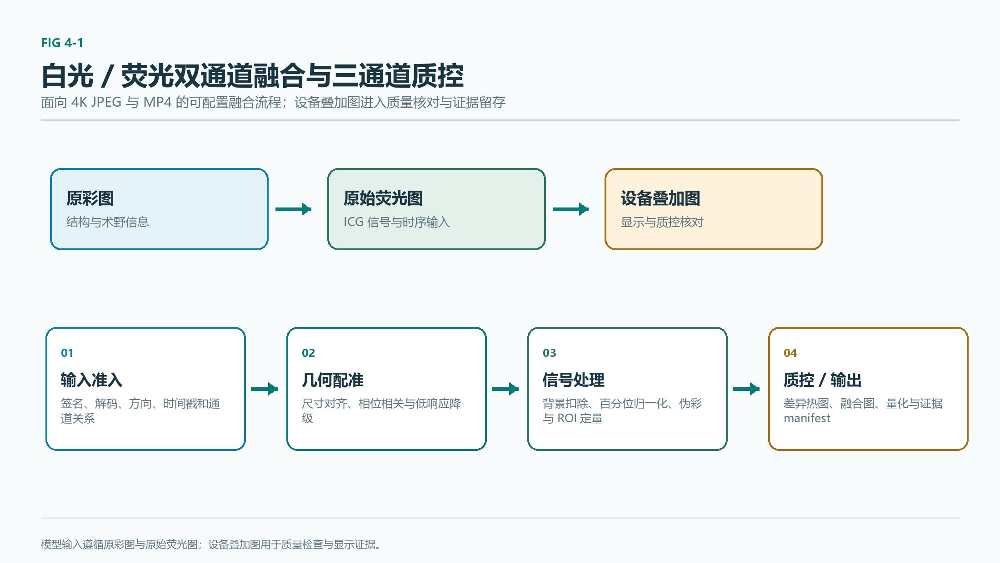
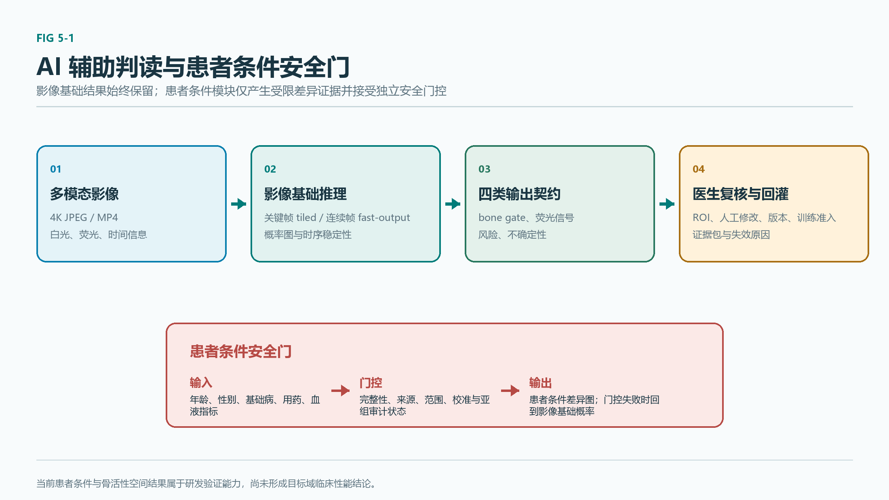

# 颌骨骨髓炎智能化荧光诊疗平台可行性报告

版本：精简提交稿
日期：2026 年 7 月 26 日
项目定位：面向荧光手术显微镜的颌骨骨髓炎术中辅助决策平台软件

## 摘要

颌骨骨髓炎及相关骨坏死的术中处理需要在清创充分性、正常骨保留和后续重建之间取得平衡。术野中的骨面颜色、出血、硬度、软组织状态和影像信号具有动态变化特征，单一观察线索难以稳定记录和回顾。项目围绕赛题提出的新型荧光造影剂设计、多模态医学图像融合处理和人工智能辅助显微成像判读三项要求，形成“术前数字化参考—术中多通道分析与医生复核—术后证据回顾”的平台软件闭环。

平台以赛题方确认的 4K JPEG 图像和 MP4 视频为主输入，支持白光与荧光成对分析、单路和多路视频播放、关键帧与连续帧分析、伪彩融合、感兴趣区量化、候选提示、人工标注复核、三维参考和证据导出。当前严格展示主线在公开离体荧光代理上的 Dice 为 0.917681、交并比为 0.848335；指定 4K 工程序列的配准与融合计算九成五分位耗时为 82.026 毫秒；高分辨率完整证据生成的服务端端到端九成五分位耗时为 5776.683 毫秒，连续帧快速展示路径为 176.457 毫秒。

当前数据采用分层管理。来源核验集合覆盖 15 份来源清单、47 条来源记录和 138 个本地文件，全部通过结构、存在性和完整性检查，累计核验体积约 5.51 GB；分层数据注册表登记 504 条记录，全部通过质量门，其中目标域记录和训练准入记录均为零，393 条处于后续训练准入检查范围。两套数字分别反映来源核验和分层登记，不能合并为单一数据规模。平台已完成公开资料、代理视频和数字仿体上的工程验证，真实目标域数据、医生标注和候选造影剂实验将按授权、脱敏、复核和独立评价的路径持续推进。

**关键词：**颌骨骨髓炎；荧光手术显微镜；ICG；多模态图像融合；人工智能辅助判读；医生复核；三维工程验证

## 1 项目需求与总体方案

颌骨骨髓炎术中处理面对感染、灌注改变、骨重塑受限、坏死骨形成和软组织炎症等因素。术前影像、病理、微生物学检查和临床资料为治疗方案提供依据；术野暴露和清创推进后，医生仍需综合骨面表现、软组织情况和必要检查完成判断。项目的目标是在显微镜影像文件进入软件后，将白光结构、荧光相对强度、视频时序、术前结构参考和医生意见组织为可检查、可回顾的辅助信息链。

*图 1 结构信息、荧光相关信号、风险提示和医生复核共同构成平台的辅助判读流程。*

赛题方技术资料确认显微镜影像分辨率为 3840×2160，图片采用 JPEG，视频采用 MP4，并通过 USB3.0 存储。平台将这两种文件作为主输入：成对白光和荧光图像用于配准、伪彩、融合和感兴趣区量化；视频用于原始播放、关键帧分析和连续帧串行分析。医院设备导出的 JPG 和 AVI 可经受控转换进入同一视频处理流程，并保留原始资料与转换记录。

| 赛题核心要求 | 平台方案 | 当前工程依据 |
| --- | --- | --- |
| 新型荧光造影剂设计 | 以 ICG 灌注信号为基线，规划骨亲和、感染识别和近红外发光协同的候选路线 | 公开文献、光谱适配分析和分级验证设计 |
| 多模态图像融合与处理 | 白光与荧光配准、归一化、伪彩、融合、量化和多通道质量检查 | 4K 成对图像和视频工程流程 |
| 人工智能辅助显微判读 | 生成信号候选、边界风险和不确定性提示，并接入医生标注与复核 | 公开代理上的模型工程验证与复核闭环 |

*图 2 平台将文件输入、融合处理、人工智能辅助、医生复核和证据导出组织为连续工作流。*

## 2 造影剂设计与显微系统衔接

ICG 可提供与灌注、血管通透性和组织活性相关的动态参考。炎症充血、水肿、操作过程、给药时相、曝光和组织深度均会影响信号表现，因此项目将 ICG 用作多模态分析的信号基线，并通过医生复核与其他信息共同解释。

候选第二信号围绕骨亲和、感染识别和光谱适配设计。四环素类骨结合荧光可为骨矿化与重塑相关信息提供补充；自体荧光可作为无需外源探针的研究方向；与白蛋白结合的通透性示踪可用于炎性软组织机理对照。模块化近红外候选由骨亲和端、感染识别端、发光端和连接臂构成，后续通过统一实验矩阵比较光谱、稳定性、骨结合、非特异吸附、细胞安全性、组织对比度和显微镜适配性。

| 验证阶段 | 验证内容 | 主要观察指标 |
| --- | --- | --- |
| 结构与光谱阶段 | 候选分子、ICG 与功能模块对照 | 光谱、光稳定性、滤光匹配和串扰 |
| 离体材料阶段 | 骨矿物、蛋白、血清与不同环境对照 | 骨亲和、非特异吸附和信噪比 |
| 细胞与组织阶段 | 多菌种、生物膜、细胞与无菌对照 | 选择性、竞争抑制和安全性初筛 |
| 显微适配阶段 | 活骨、坏死骨、炎症软组织与仿体 | 边界对比、深度、剂量窗口和成像适配 |
| 高级验证阶段 | 经伦理批准的前临床研究 | 药代、安全性、病理与培养对照 |

软件平台可记录采集时相、激发与发射范围、曝光、增益、倍率、工作距离和背景策略，完成多通道质量检查、伪彩、时间曲线和证据回顾。候选造影剂的性能结论将随实测证据逐级形成。

## 3 多模态图像融合与处理

平台支持单路视频、白光与荧光双路视频，以及原彩图、荧光图和设备叠加图组成的三路资料。原彩图和原始荧光图用于融合与模型分析；设备叠加图用于显示参照和一致性核对。每次分析保留通道角色、时长、帧率、时间偏移、共同有效区间和同步状态。

融合处理依次完成输入检查、几何一致性判断、荧光背景处理、空间配准、强度归一化、伪彩映射、透明融合、局部增强、感兴趣区量化和证据写出。配准采用多尺度相位相关作为平移基线，并结合局部补偿处理遮挡、倍率变化和残余几何差异。质量不足时，平台保留原始画面与处理记录，并将融合结果交由医生结合术野情况复核。

*图 3 原彩图和原始荧光图进入配准、归一化、伪彩和融合流程，设备叠加图用于一致性核对。*

*图 4 公开人体 ICG 骨移植视频关键帧用于融合、可视化和证据流程验证，医学场景与目标域不同。*

视频分析包括离线关键帧和连续帧串行两种机制。关键帧分析用于完整证据生成和回放复核；连续帧分析在上一帧完成后处理下一帧，持续显示最近已完成结果及其时间信息。平台分别记录视频播放、关键帧采样、单帧处理和端到端刷新时间，便于评审理解实际处理节奏。

在指定 4K 工程序列中，配准计算的九成五分位耗时为 59.022 毫秒，归一化、伪彩和融合计算为 21.891 毫秒，合计为 82.026 毫秒。该内部工程计时只覆盖配准和融合计算；解码、证据生成、存储、传输和人工智能推理分别记录。局部残差补偿将该序列的局部残差九成五分位由 5.187 像素降至 1.361 像素。

*图 5 4K 输入可进入完整证据生成或连续帧处理流程。*

## 4 人工智能辅助判读与医生复核

平台的第一阶段人工智能任务是从显微图像和视频中组织暴露区域、荧光或灌注相关信号、边界风险和不确定性提示。结果通过骨面范围、荧光信号、风险区域和不确定区域四类复核图层呈现。骨面范围依赖医生感兴趣区或提示辅助后的复核结果；未获得相应复核时，该图层保持待复核状态。

*图 6 平台将输入影像、融合检查、候选提示、人工修改和受控回灌连接为闭环。*

主线残差注意力 U 形网络在公开离体荧光代理锁定测试集上的 Dice 为 0.917681、交并比为 0.848335、召回率为 0.9099，三次独立训练的 Dice 均值为 0.914894，标准差为 0.004139。轻量候选模型在同一协议下的 Dice 为 0.8978，标准差为 0.0113；当前作为后续比较对象保留。

患者条件信息已纳入软件的数据接入、结果呈现和回退流程。公开 CT 代理上的条件候选 Dice 为 0.243974，影像基础结果为 0.244188，边界位移检查未达到要求，平台因此固定显示影像基础结果。骨活性候选在公开显微荧光代理上的综合 Dice 为 0.733064，接受覆盖率和选择性错误率未达到工程要求，空间分类当前不进入主展示流程。

医生复核界面支持画笔、橡皮擦、多边形、缩放、撤销、重做、草稿、提交复核和版本回看。通过或修改后的标注可作为高优先级训练候选，驳回标注用于错误分析，待复核资料保持独立管理。后续模型将在统一数据清单、来源分组、预处理和评价协议下比较分割质量、校准、资源占用和视频稳定性。

## 5 工程验证与软件展示

来源核验集合覆盖 15 份来源清单、47 条来源记录和 138 个本地文件，全部通过结构、存在性和完整性检查，累计核验体积约为 5.51 GB。分层数据注册表登记 504 条记录，全部通过质量门，其中目标域记录和训练准入记录均为零，393 条处于后续训练准入检查范围。这两套数字分别服务于来源核验和分层登记，报告中保持独立说明。

| 处理路径 | 模型计算九成五分位耗时 | 服务端端到端九成五分位耗时 | 峰值显存 | 用途 |
| --- | ---: | ---: | ---: | --- |
| 4K 完整证据生成 | 724.432 毫秒 | 5776.683 毫秒 | 723.579 MB | 高分辨率关键帧的完整结果与证据材料 |
| 连续帧快速展示 | 36.377 毫秒 | 176.457 毫秒 | 380.134 MB | 视频播放期间的串行更新 |

*图 7 关键帧、相对信号变化和复核图层的时间轴组织。*

*图 8 完整证据生成与连续帧快速展示分别服务于高分辨率分析和稳定播放。*

三维能力以未配准参考、静态仿体配准、离线位姿回放和真实术中定位四个层级管理。当前平台主展示为未配准三维参考。静态仿体测试已完成点集配准、相机位姿和误差记录；离线动态验证完成 766 帧公开 RGB-D 代理关联、2556 组位姿记录与 24 帧受控回放，最大时间差为 9.693 毫秒。真实术中定位将在真实标定、患者配准、跟踪、误差评价和医生复核资料齐备后开展验证。

*图 9 平台将公开三维参考、视频关键帧、风险图层和复核状态组织在同一工作流中。*

平台的软件展示按数据准入、病例档案、病例工作台、三维导航、医生复核和报告导出的顺序组织。评审可沿同一病例查看原始视频、融合结果、候选图层、复核修改和导出材料，检查输入来源、处理过程和人工意见之间的对应关系。

## 6 创新性、可行性与后续计划

项目的创新点体现在三个方面。第一，将白光、荧光、设备叠加资料、关键帧结果和三维参考组织为同一病例工作台，使原始画面、信号变化和人工智能提示保持可对照。第二，将融合、候选提示、医生修改和证据导出连接为连续链路，形成可回顾的资料组织方式。第三，采用来源核验集合与分层数据注册表并行管理公开代理、近域资料、人体 ICG 视频和三维解剖资料，使展示内容、工程验证和后续训练准备具有明确的用途区分。

项目已完成官方文件输入、白光与荧光融合、多通道质量检查、人工智能候选提示、医生复核、证据导出和三维工程参考的可运行闭环。后续将持续推进真实目标域资料的规范接入、医生关键帧与感兴趣区标注、候选造影剂的分级实验、物理仿体与离线回放验证，以及基于独立测试的模型比较。平台在每一阶段保留来源、处理、复核和评价记录，为团队后续形成更高等级的工程与研究证据提供基础。
